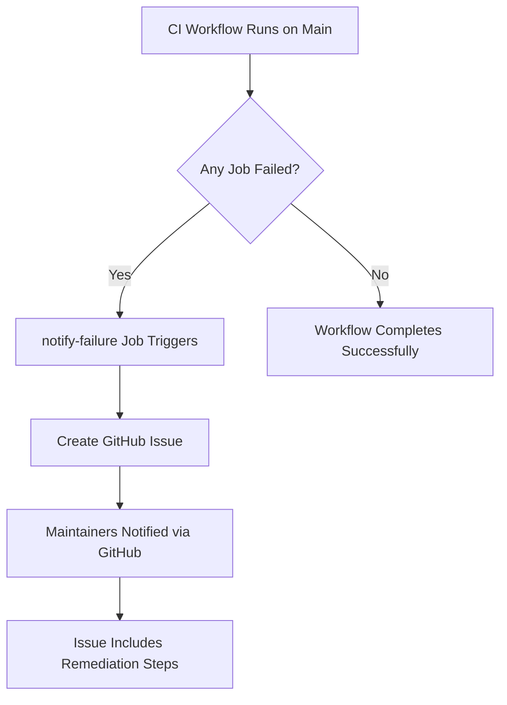
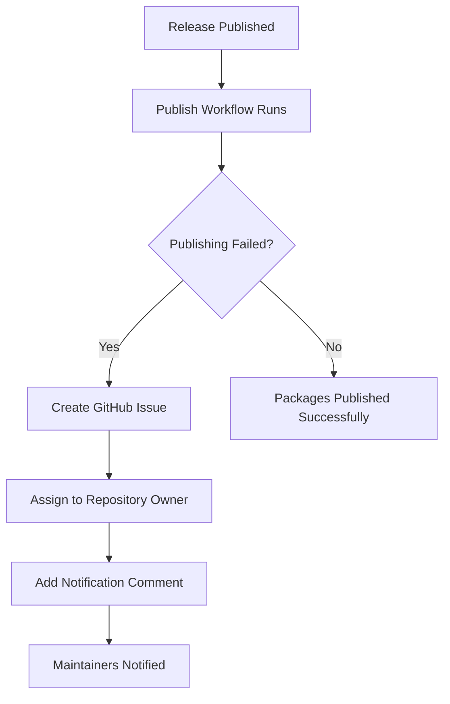

# Workflow Failure Notifications

This document describes the automated failure notification system implemented for the Kaiord CI/CD workflows.

## Overview

The failure notification system automatically creates GitHub issues when workflows fail, providing detailed error information and remediation steps to maintainers.

## Implementation

### 1. CI Workflow Failure Detection (Main Branch)

**Location:** `.github/workflows/ci.yml`

**Trigger:** When any CI job fails on the `main` branch

**Job:** `notify-failure`

**Features:**

- Detects failures in: lint, typecheck, test, build, and round-trip jobs
- Only runs on the `main` branch (not on PRs)
- Creates a GitHub issue with:
  - List of failed jobs
  - Commit information (SHA, author, message)
  - Direct link to workflow run
  - Detailed remediation steps
  - Priority label (HIGH)

**Issue Labels:**

- `ci`
- `bug`
- `automated`
- `priority-high`

**Example Issue Title:**

```
🚨 CI Failure on main branch
```

### 2. Release Workflow Failure Notifications

**Location:** `.github/workflows/release.yml`

**Trigger:** When package publishing fails during a release

**Features:**

- Detects failures in publishing @kaiord/core or @kaiord/cli
- Creates a GitHub issue with:
  - Release tag and workflow run link
  - List of failed packages
  - Error logs from retry attempts
  - Common causes and troubleshooting guide
  - Manual publishing instructions
  - Priority label (CRITICAL)
- Assigns issue to repository owner
- Adds follow-up comment to notify maintainers explicitly

**Issue Labels:**

- `release`
- `bug`
- `automated`
- `priority-critical`

**Example Issue Title:**

```
🚨 Release publishing failed for @kaiord/core, @kaiord/cli - v1.2.3
```

## Notification Flow

### CI Failure on Main Branch



### Release Failure



## Issue Content

### CI Failure Issue

Each CI failure issue includes:

1. **Header:** Commit SHA, author, workflow run link, timestamp
2. **Failed Jobs:** List of jobs that failed (Lint, Type Check, Tests, Build, Round-trip)
3. **Workflow Details:** Branch, commit message, commit URL
4. **Error Logs:** Link to complete workflow logs
5. **Remediation Steps:** Commands to reproduce and fix locally
6. **Priority:** HIGH - immediate action required
7. **Checklist:** Steps to resolve the issue

### Release Failure Issue

Each release failure issue includes:

1. **Header:** Release tag, workflow run link, triggered by, timestamp
2. **Failed Packages:** List of packages that failed to publish
3. **Error Logs:** Details from retry attempts
4. **Common Causes:** List of typical failure reasons
5. **Remediation Steps:**
   - Verify NPM token
   - Check npm registry status
   - Verify package versions
   - Manual publishing instructions
   - Re-run workflow steps
6. **Priority:** CRITICAL - release is blocked
7. **Notification:** Explicit mention of repository owner
8. **Checklist:** Steps to resolve the issue

## Remediation Workflow

### For CI Failures

1. Review the automatically created issue
2. Click the workflow run link to view detailed logs
3. Identify the failing job(s)
4. Run tests locally to reproduce:
   ```bash
   pnpm install
   pnpm lint
   pnpm exec tsc --noEmit
   pnpm test
   pnpm -r build
   ```
5. Fix the identified issues
6. Push the fix to main
7. Verify the next workflow run passes
8. Close the issue

### For Release Failures

1. Review the automatically created issue
2. Check the workflow logs for specific error messages
3. Verify NPM_TOKEN is valid:
   ```bash
   npm whoami --registry https://registry.npmjs.org
   ```
4. Check npm registry status: https://status.npmjs.org/
5. Verify package versions:
   ```bash
   npm view @kaiord/core version
   npm view @kaiord/cli version
   ```
6. If needed, manually publish:
   ```bash
   pnpm -r build
   pnpm --filter @kaiord/core publish --access public
   pnpm --filter @kaiord/cli publish --access public
   ```
7. Verify packages are available on npm
8. Close the issue

## Benefits

1. **Immediate Awareness:** Maintainers are notified immediately when workflows fail
2. **Detailed Context:** Issues include all relevant information for debugging
3. **Actionable Steps:** Clear remediation instructions reduce time to resolution
4. **Audit Trail:** GitHub issues provide a historical record of failures
5. **Priority Labeling:** Critical issues are clearly marked for urgent attention
6. **Automated Assignment:** Release failures are automatically assigned to the owner

## Configuration

### Required Permissions

**CI Workflow:**

```yaml
permissions:
  contents: read
  pull-requests: write
  checks: write
  issues: write # Added for failure notifications
```

**Release Workflow:**

```yaml
permissions:
  contents: write
  packages: write
  issues: write # Already present
```

### GitHub Actions Used

- `actions/github-script@v7` - For creating issues and comments via GitHub API

## Testing

To test the failure notification system:

### CI Failure Test

1. Create a branch from main
2. Introduce a failing test or linting error
3. Merge to main (or push directly)
4. Verify the `notify-failure` job runs
5. Check that a GitHub issue is created

### Release Failure Test

1. Create a release with an invalid NPM_TOKEN
2. Verify the publish job fails
3. Check that a GitHub issue is created
4. Verify the repository owner is assigned
5. Verify the notification comment is added

## Maintenance

### Updating Notification Content

To modify the issue content:

1. Edit the `script` section in the respective workflow file
2. Update the issue body template
3. Test with a controlled failure
4. Verify the new content appears correctly

### Adding New Failure Scenarios

To add notifications for new failure types:

1. Identify the job that can fail
2. Add the job to the `needs` array in `notify-failure`
3. Add a condition to check the job result
4. Update the failed jobs list in the script
5. Test the new scenario

## Related Documentation

- [CI Workflow Documentation](.github/workflows/README.md)
- [Release Workflow Documentation](.github/workflows/README.md)
- [GitHub Actions Documentation](https://docs.github.com/en/actions)
- [GitHub Script Action](https://github.com/actions/github-script)

## Requirements Satisfied

This implementation satisfies the following requirements from the spec:

- **Requirement 12.1:** Create GitHub issue when workflow fails on main branch
- **Requirement 12.2:** Send notification when release workflow fails
- **Requirement 12.4:** Include workflow run URL in notifications
- **Requirement 12.5:** Include error logs in failure notifications
