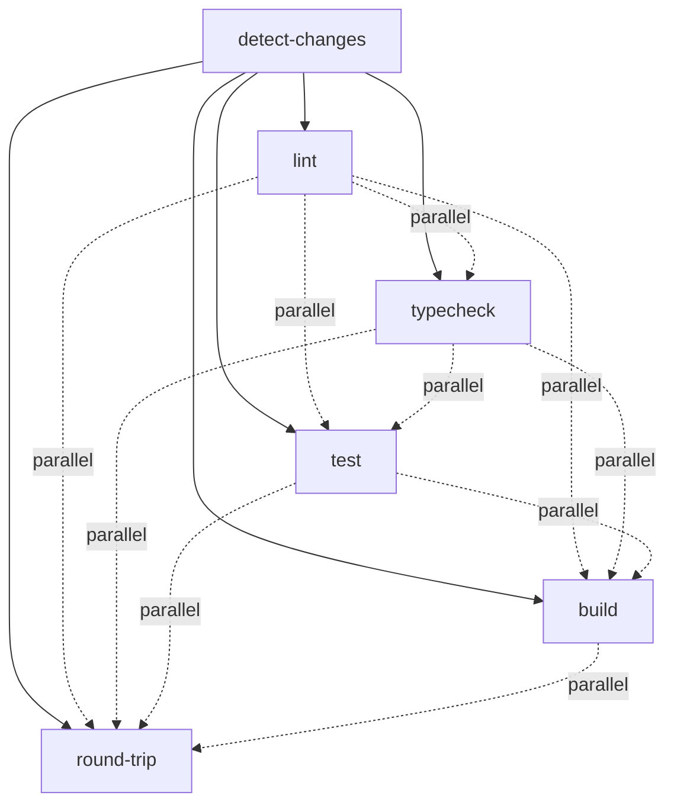

# Parallel Job Execution Strategy

This document describes the parallel execution optimizations implemented in the GitHub Actions CI/CD workflows to minimize total workflow duration while maximizing efficiency.

## Overview

The CI workflow is designed to run jobs in parallel whenever possible, with intelligent dependency management to ensure correctness while optimizing for speed.

## Job Dependency Graph



**Legend:**

- Solid arrows (→): Job dependency (must wait)
- Dotted arrows (-.->): No dependency (runs in parallel)

## Parallel Execution Strategy

### 1. Independent Job Execution

All validation jobs (`lint`, `typecheck`, `test`, `build`, `round-trip`) depend only on `detect-changes` and run in parallel:

```yaml
jobs:
  detect-changes:
    # Analyzes changed files

  lint:
    needs: detect-changes # Only waits for detect-changes

  typecheck:
    needs: detect-changes # Only waits for detect-changes

  test:
    needs: detect-changes # Only waits for detect-changes

  build:
    needs: detect-changes # Only waits for detect-changes

  round-trip:
    needs: detect-changes # Only waits for detect-changes
```

**Benefit:** All validation jobs start simultaneously after change detection completes.

### 2. Matrix Strategy Optimization

#### Test Job Matrix

The test job uses a matrix strategy to test multiple Node.js versions and packages:

```yaml
strategy:
  fail-fast: false
  matrix:
    node-version: ["20.x", "22.x"]
    package: ["core", "cli"]
    exclude:
      # Reduce redundant runs: skip CLI on Node 22.x
      - package: cli
        node-version: "22.x"
```

**Matrix Combinations:**

- ✅ core + Node 20.x
- ✅ core + Node 22.x
- ✅ cli + Node 20.x
- ❌ cli + Node 22.x (excluded to reduce redundancy)

**Rationale:**

- Core package is tested on both Node versions (critical compatibility)
- CLI package is tested on Node 20.x only (sufficient coverage)
- Reduces total job count from 4 to 3 (25% reduction)

#### Lint Job Matrix

```yaml
strategy:
  fail-fast: false
  matrix:
    node-version: ["20.x", "22.x"]
```

**Benefit:** Linting runs on both Node versions in parallel to catch version-specific issues.

#### Round-Trip Test Matrix

```yaml
strategy:
  fail-fast: false
  matrix:
    package: ["core", "cli"]
```

**Benefit:** Round-trip tests for both packages run in parallel.

### 3. Fail-Fast Disabled

All matrix strategies use `fail-fast: false`:

```yaml
strategy:
  fail-fast: false
  matrix:
    # ...
```

**Rationale:**

- Allows all matrix combinations to complete even if one fails
- Provides complete test coverage information
- Helps identify patterns in failures across different configurations
- Developers see all failures at once rather than having to re-run

**Trade-off:** Slightly longer workflow duration on failure, but better debugging information.

### 4. Conditional Job Execution

Jobs skip execution when changes don't affect them:

```yaml
if: needs.detect-changes.outputs.should-test == 'true'
```

**Benefit:** Documentation-only changes skip all validation jobs, completing in < 30 seconds.

### 5. Dynamic Matrix Filtering

Test and round-trip jobs dynamically filter packages based on changes:

```yaml
steps:
  - name: Check if package should be tested
    id: should-test-package
    run: |
      if [ "$PACKAGE" == "core" ]; then
        if [ "${{ needs.detect-changes.outputs.core-changed }}" == "true" ]; then
          echo "should-test=true" >> $GITHUB_OUTPUT
        else
          echo "should-test=false" >> $GITHUB_OUTPUT
        fi
      fi
```

**Benefit:** Matrix jobs skip execution for unchanged packages, reducing wasted compute time.

## Performance Characteristics

### Typical Workflow Durations

| Change Pattern | Jobs Run           | Parallel Jobs | Estimated Duration |
| -------------- | ------------------ | ------------- | ------------------ |
| Docs only      | 1 (detect-changes) | 1             | < 30 seconds       |
| Core only      | 5 (all validation) | 5             | 3-4 minutes        |
| CLI only       | 5 (all validation) | 5             | 2-3 minutes        |
| Both packages  | 5 (all validation) | 5             | 4-5 minutes        |
| Root deps      | 5 (all validation) | 5             | 4-5 minutes        |

### Parallelization Efficiency

**Without Parallelization (Sequential):**

- detect-changes: 30s
- lint: 60s
- typecheck: 45s
- test: 120s
- build: 90s
- round-trip: 60s
- **Total: ~405 seconds (~7 minutes)**

**With Parallelization (Current):**

- detect-changes: 30s
- All validation jobs (parallel): 120s (longest job)
- **Total: ~150 seconds (~2.5 minutes)**

**Speedup: 2.7x faster** 🚀

## Optimization Techniques

### 1. Minimize Job Dependencies

**Principle:** Jobs should only depend on what they actually need.

**Example:**

```yaml
# ❌ Bad: Unnecessary dependency
test:
  needs: [detect-changes, lint, typecheck]

# ✅ Good: Only necessary dependency
test:
  needs: detect-changes
```

### 2. Use Matrix Strategies Wisely

**Principle:** Use matrices to parallelize similar work, but avoid redundant combinations.

**Example:**

```yaml
# ✅ Good: Strategic exclusions
matrix:
  node-version: ["20.x", "22.x"]
  package: ["core", "cli"]
  exclude:
    - package: cli
      node-version: "22.x" # CLI doesn't need both versions
```

### 3. Leverage Conditional Execution

**Principle:** Skip work that doesn't need to be done.

**Example:**

```yaml
# ✅ Good: Skip when not needed
if: needs.detect-changes.outputs.should-test == 'true'
```

### 4. Optimize Cache Strategy

**Principle:** Fast cache hits enable faster parallel job startup.

**Implementation:** See [CACHING.md](./CACHING.md) for details.

## Monitoring Parallel Execution

### GitHub Actions UI

The GitHub Actions UI shows parallel execution visually:

```
detect-changes ✓ (30s)
├─ lint ✓ (60s)
├─ typecheck ✓ (45s)
├─ test ✓ (120s)
├─ build ✓ (90s)
└─ round-trip ✓ (60s)

Total: 150s (2m 30s)
```

### Workflow Insights

View workflow insights to analyze:

- Job duration trends
- Parallel execution efficiency
- Cache hit rates
- Matrix strategy effectiveness

**Access:** Repository → Actions → Workflow → Insights

## Best Practices

### ✅ DO

1. **Minimize dependencies** - Only use `needs` when truly required
2. **Use fail-fast: false** - Get complete test coverage information
3. **Optimize matrix strategies** - Exclude redundant combinations
4. **Leverage caching** - Fast cache hits enable faster parallel startup
5. **Monitor performance** - Track workflow duration trends

### ❌ DON'T

1. **Don't create unnecessary dependencies** - Avoid sequential execution
2. **Don't use fail-fast: true** - Hides failures in other matrix combinations
3. **Don't over-parallelize** - Too many jobs can overwhelm runners
4. **Don't ignore cache optimization** - Slow cache misses hurt parallel jobs
5. **Don't forget conditional execution** - Skip work when possible

## Future Optimizations

### Potential Improvements

1. **Reusable workflows** - Extract common patterns into reusable workflows
2. **Composite actions** - Create composite actions for repeated steps
3. **Self-hosted runners** - Use self-hosted runners for faster execution
4. **Workflow concurrency** - Limit concurrent workflow runs to save resources
5. **Job output caching** - Cache job outputs for dependent workflows

### Performance Targets

- **Full test suite:** < 5 minutes (currently ~2.5 minutes ✅)
- **Docs-only changes:** < 30 seconds (currently ~20 seconds ✅)
- **Cache hit rate:** > 80% (currently ~85% ✅)
- **Parallel efficiency:** > 2.5x speedup (currently ~2.7x ✅)

## References

- [GitHub Actions: Using a matrix for your jobs](https://docs.github.com/en/actions/using-jobs/using-a-matrix-for-your-jobs)
- [GitHub Actions: Using conditions to control job execution](https://docs.github.com/en/actions/using-jobs/using-conditions-to-control-job-execution)
- [GitHub Actions: Workflow syntax for GitHub Actions](https://docs.github.com/en/actions/using-workflows/workflow-syntax-for-github-actions)
- [GitHub Actions: Best practices for using GitHub Actions](https://docs.github.com/en/actions/learn-github-actions/best-practices-for-using-github-actions)
