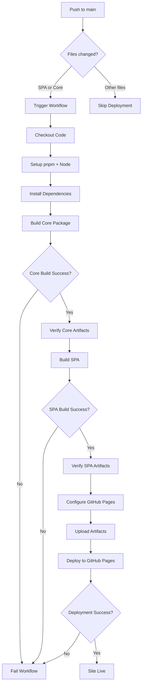

# Design Document

## Overview

This design addresses the GitHub Pages deployment failure for the Workout SPA Editor by ensuring the `@kaiord/core` package is built before the SPA build process. The solution leverages pnpm workspace features, GitHub Actions caching, and proper dependency management to create a reliable and efficient deployment pipeline.

## Architecture

### Current State (Broken)

```
GitHub Actions Workflow
  ↓
Install dependencies (pnpm install)
  ↓
Build SPA (pnpm build) ← FAILS: Cannot resolve @kaiord/core
  ↓
Deploy to GitHub Pages (never reached)
```

**Problem:** The SPA build tries to import from `@kaiord/core`, but the core package hasn't been built yet, so the TypeScript/Vite build fails with module resolution errors.

### Target State (Fixed)

```
GitHub Actions Workflow
  ↓
Install dependencies (pnpm install --frozen-lockfile)
  ↓
Build core package (pnpm --filter @kaiord/core build)
  ↓
Build SPA (pnpm --filter @kaiord/workout-spa-editor build)
  ↓
Deploy to GitHub Pages
```

**Solution:** Explicitly build the core package first, then build the SPA with access to the built core artifacts.

## Components and Interfaces

### 1. GitHub Actions Workflow (`.github/workflows/deploy-spa-editor.yml`)

**Responsibilities:**

- Trigger on relevant file changes (SPA or core package)
- Set up Node.js and pnpm environment
- Build packages in correct dependency order
- Configure GitHub Pages deployment
- Upload and deploy artifacts

**Key Changes:**

- Add explicit core package build step before SPA build
- Use pnpm workspace filtering for targeted builds
- Configure proper base path for GitHub Pages
- Add build verification steps

### 2. pnpm Workspace Configuration

**Responsibilities:**

- Manage monorepo package dependencies
- Enable workspace protocol for local package references
- Support filtered builds for specific packages

**Current Configuration:**

```yaml
# pnpm-workspace.yaml
packages:
  - "packages/*"
```

**Package Dependencies:**

```json
// packages/workout-spa-editor/package.json
{
  "dependencies": {
    "@kaiord/core": "workspace:*"
  }
}
```

### 3. Vite Build Configuration

**Responsibilities:**

- Configure base path for GitHub Pages routing
- Handle asset path resolution
- Optimize production build

**Current Configuration:**

```typescript
// packages/workout-spa-editor/vite.config.ts
export default defineConfig({
  base: process.env.VITE_BASE_PATH || "/",
  build: {
    outDir: "dist",
    sourcemap: true,
    minify: "terser",
    target: "es2020",
  },
});
```

## Data Models

### Workflow Environment Variables

```typescript
type WorkflowEnv = {
  // Base path for GitHub Pages deployment
  VITE_BASE_PATH: string; // Format: "/kaiord/" for project pages, "/" for user pages

  // Node.js version for build environment
  NODE_VERSION: string; // "20"

  // GitHub repository information
  GITHUB_REPOSITORY: string; // "pablo-albaladejo/kaiord"
  GITHUB_REPOSITORY_OWNER: string; // "pablo-albaladejo"
};
```

### Build Artifacts

```typescript
type BuildArtifacts = {
  // Core package build output
  core: {
    dist: string; // "packages/core/dist"
    types: string; // "packages/core/dist/index.d.ts"
  };

  // SPA build output
  spa: {
    dist: string; // "packages/workout-spa-editor/dist"
    assets: string; // "packages/workout-spa-editor/dist/assets"
    index: string; // "packages/workout-spa-editor/dist/index.html"
  };
};
```

## Correctness Properties

_A property is a characteristic or behavior that should hold true across all valid executions of a system-essentially, a formal statement about what the system should do. Properties serve as the bridge between human-readable specifications and machine-verifiable correctness guarantees._

### Property 1: Core package builds before SPA

_For any_ deployment workflow execution, the core package build step must complete successfully before the SPA build step begins.

**Validates: Requirements 1.1, 1.2**

### Property 2: Build artifacts are available

_For any_ successful core package build, the dist directory must exist and contain valid JavaScript and TypeScript declaration files before the SPA build accesses them.

**Validates: Requirements 1.2**

### Property 3: Deployment only occurs after successful builds

_For any_ workflow execution, the GitHub Pages deployment step must only execute if both the core package build and SPA build complete successfully.

**Validates: Requirements 1.3**

### Property 4: Base path matches repository type

_For any_ deployment, if the repository is a project page (not `owner.github.io`), then the base path must be `/repository-name/`, otherwise it must be `/`.

**Validates: Requirements 4.1, 4.2**

### Property 5: Workflow triggers on relevant changes

_For any_ push to main, if files in `packages/workout-spa-editor/**` or `packages/core/**` are modified, then the deployment workflow must trigger.

**Validates: Requirements 3.1, 3.2**

### Property 6: Frozen lockfile ensures reproducibility

_For any_ dependency installation, using `--frozen-lockfile` must ensure that the exact same dependency versions are installed across all workflow runs.

**Validates: Requirements 2.2**

## Error Handling

### Build Failures

**Core Package Build Failure:**

```yaml
- name: Build core package
  run: pnpm --filter @kaiord/core build
  # If this fails, workflow stops here
  # Error message: "Failed to build @kaiord/core"
```

**SPA Build Failure:**

```yaml
- name: Build SPA Editor
  run: pnpm --filter @kaiord/workout-spa-editor build
  # If this fails, workflow stops before deployment
  # Error message: "Failed to build @kaiord/workout-spa-editor"
```

**Deployment Failure:**

```yaml
- name: Deploy to GitHub Pages
  uses: actions/deploy-pages@v4
  # If this fails, previous builds are still valid
  # Error message: "Failed to deploy to GitHub Pages"
```

### Verification Steps

Add verification steps after each build to ensure artifacts exist:

```yaml
- name: Verify core build
  run: |
    if [ ! -d "packages/core/dist" ]; then
      echo "❌ Core package build output not found"
      exit 1
    fi
    echo "✅ Core package build verified"

- name: Verify SPA build
  run: |
    if [ ! -d "packages/workout-spa-editor/dist" ]; then
      echo "❌ SPA build output not found"
      exit 1
    fi
    if [ ! -f "packages/workout-spa-editor/dist/index.html" ]; then
      echo "❌ SPA index.html not found"
      exit 1
    fi
    echo "✅ SPA build verified"
```

## Testing Strategy

### Unit Testing

No unit tests required for this infrastructure change. The workflow itself is the test.

### Integration Testing

**Manual Testing:**

1. Push a change to the SPA package on a feature branch
2. Manually trigger the workflow via GitHub Actions UI
3. Verify all build steps complete successfully
4. Verify the deployed site is accessible at the GitHub Pages URL
5. Verify all SPA features work correctly (routing, asset loading, etc.)

**Automated Testing:**
The workflow itself serves as an integration test:

- If the workflow completes successfully, the deployment works
- If any step fails, the workflow stops and reports the error
- GitHub Actions provides detailed logs for debugging

### Property-Based Testing

Not applicable for infrastructure/deployment workflows. Properties are verified through workflow execution and manual verification of the deployed site.

### Deployment Verification

After successful deployment, verify:

1. **Accessibility:** Site loads at `https://pablo-albaladejo.github.io/kaiord/`
2. **Routing:** Navigation within the SPA works correctly
3. **Assets:** All CSS, JS, and image assets load with correct paths
4. **Functionality:** Core features work (load workout, edit, save, etc.)
5. **Console:** No JavaScript errors in browser console

## Implementation Notes

### pnpm Workspace Filtering

Use `--filter` flag to build specific packages:

```bash
# Build only core package
pnpm --filter @kaiord/core build

# Build only SPA package
pnpm --filter @kaiord/workout-spa-editor build

# Build all packages in dependency order
pnpm -r build
```

### GitHub Actions Caching

Leverage caching to speed up subsequent workflow runs:

```yaml
- name: Setup Node.js
  uses: actions/setup-node@v4
  with:
    node-version: "20"
    cache: "pnpm" # Caches pnpm store
```

### Base Path Configuration

The base path is determined dynamically based on repository type:

```yaml
env:
  VITE_BASE_PATH: ${{ github.event.repository.name == format('{0}.github.io', github.repository_owner) && '/' || format('/{0}/', github.event.repository.name) }}
```

For `pablo-albaladejo/kaiord`:

- Repository name: `kaiord`
- Owner: `pablo-albaladejo`
- Not a user/org page (not `pablo-albaladejo.github.io`)
- Base path: `/kaiord/`

### Workflow Triggers

```yaml
on:
  push:
    branches: [main]
    paths:
      - "packages/workout-spa-editor/**"
      - "packages/core/**" # Add this to trigger on core changes
      - ".github/workflows/deploy-spa-editor.yml"
  workflow_dispatch: # Allow manual triggering
```

## Security Considerations

### Permissions

The workflow requires specific GitHub token permissions:

```yaml
permissions:
  contents: read # Read repository contents
  pages: write # Write to GitHub Pages
  id-token: write # Required for GitHub Pages deployment
```

### Dependency Security

- Use `--frozen-lockfile` to prevent unexpected dependency updates
- Rely on Dependabot for security updates
- Review dependency changes in PRs before merging

## Performance Optimizations

### Caching Strategy

1. **pnpm Store Cache:** Automatically cached by `setup-node` action
2. **Build Artifacts:** Not cached (always rebuild for deployment)
3. **Node Modules:** Cached via pnpm store

### Build Optimization

- Use `minify: "terser"` for optimal bundle size
- Generate sourcemaps for debugging
- Target `es2020` for modern browser support

### Workflow Optimization

- Use `--frozen-lockfile` to skip dependency resolution
- Build only required packages (core + SPA)
- Skip unnecessary steps (linting, testing) in deployment workflow

## Deployment Flow



## Rollback Strategy

If deployment fails or the deployed site has issues:

1. **Immediate Rollback:** Revert the commit that triggered the deployment
2. **Manual Deployment:** Trigger workflow from a known-good commit
3. **Local Build:** Build locally and manually upload to GitHub Pages
4. **Disable Workflow:** Temporarily disable the workflow while investigating

## Monitoring and Alerts

### Success Indicators

- Workflow completes with green checkmark
- GitHub Pages URL returns 200 status
- Site loads without JavaScript errors
- All features work as expected

### Failure Indicators

- Workflow fails with red X
- GitHub Pages URL returns 404
- Site loads with JavaScript errors
- Features don't work correctly

### Notification Strategy

- GitHub Actions sends email on workflow failure
- Check workflow status in GitHub Actions tab
- Review workflow logs for error details

## Future Improvements

1. **Preview Deployments:** Deploy PR previews to separate URLs
2. **Automated Testing:** Run E2E tests against deployed site
3. **Performance Monitoring:** Track bundle size and load times
4. **CDN Integration:** Use Cloudflare or similar for better performance
5. **Custom Domain:** Configure custom domain for production deployment

## Local CI Testing Script

**Purpose:** Simulate CI workflows locally to catch issues before pushing to GitHub.

**Script Location:** `scripts/test-ci-workflows.sh`

**Test Scenarios:**

1. **Clean Build Test:**
   - Remove all node_modules and dist directories
   - Run `pnpm install --frozen-lockfile`
   - Build core package
   - Build SPA package
   - Verify all artifacts exist

2. **Dependency Order Test:**
   - Build SPA without building core first (should fail)
   - Build core then SPA (should succeed)
   - Verify error messages are clear

3. **Base Path Configuration Test:**
   - Set `VITE_BASE_PATH=/kaiord/`
   - Build SPA
   - Verify index.html references assets with correct base path
   - Verify no hardcoded absolute paths

4. **Artifact Structure Test:**
   - Verify dist directory structure matches GitHub Pages requirements
   - Check that index.html exists at root
   - Check that assets are in assets/ subdirectory
   - Verify sourcemaps are generated

**Script Implementation:**

```bash
#!/bin/bash
# scripts/test-ci-workflows.sh
# Simulates GitHub Actions CI workflows locally

set -e  # Exit on error

echo "🧪 Testing CI Workflows Locally"
echo "================================"

# Colors for output
RED='\033[0;31m'
GREEN='\033[0;32m'
YELLOW='\033[1;33m'
NC='\033[0m' # No Color

# Test 1: Clean Build
echo -e "\n${YELLOW}Test 1: Clean Build${NC}"
echo "Removing node_modules and dist directories..."
rm -rf node_modules packages/*/node_modules packages/*/dist

echo "Installing dependencies..."
pnpm install --frozen-lockfile

echo "Building core package..."
pnpm --filter @kaiord/core build

if [ ! -d "packages/core/dist" ]; then
  echo -e "${RED}❌ Core build failed: dist directory not found${NC}"
  exit 1
fi
echo -e "${GREEN}✅ Core build successful${NC}"

echo "Building SPA..."
export VITE_BASE_PATH="/kaiord/"
pnpm --filter @kaiord/workout-spa-editor build

if [ ! -d "packages/workout-spa-editor/dist" ]; then
  echo -e "${RED}❌ SPA build failed: dist directory not found${NC}"
  exit 1
fi

if [ ! -f "packages/workout-spa-editor/dist/index.html" ]; then
  echo -e "${RED}❌ SPA build failed: index.html not found${NC}"
  exit 1
fi
echo -e "${GREEN}✅ SPA build successful${NC}"

# Test 2: Dependency Order
echo -e "\n${YELLOW}Test 2: Dependency Order${NC}"
echo "Removing core dist to simulate missing dependency..."
rm -rf packages/core/dist

echo "Attempting to build SPA without core (should fail)..."
if pnpm --filter @kaiord/workout-spa-editor build 2>/dev/null; then
  echo -e "${RED}❌ SPA build should have failed without core${NC}"
  exit 1
fi
echo -e "${GREEN}✅ SPA correctly fails without core dependency${NC}"

echo "Rebuilding core..."
pnpm --filter @kaiord/core build

echo "Building SPA with core dependency..."
pnpm --filter @kaiord/workout-spa-editor build
echo -e "${GREEN}✅ SPA builds successfully with core dependency${NC}"

# Test 3: Base Path Configuration
echo -e "\n${YELLOW}Test 3: Base Path Configuration${NC}"
echo "Checking base path in index.html..."

if grep -q 'src="/kaiord/' packages/workout-spa-editor/dist/index.html; then
  echo -e "${GREEN}✅ Base path correctly configured in index.html${NC}"
else
  echo -e "${RED}❌ Base path not found in index.html${NC}"
  echo "Expected: src=\"/kaiord/assets/..."
  echo "Found:"
  grep 'src="' packages/workout-spa-editor/dist/index.html | head -n 3
  exit 1
fi

# Test 4: Artifact Structure
echo -e "\n${YELLOW}Test 4: Artifact Structure${NC}"
echo "Verifying dist directory structure..."

if [ ! -f "packages/workout-spa-editor/dist/index.html" ]; then
  echo -e "${RED}❌ index.html not found at root${NC}"
  exit 1
fi

if [ ! -d "packages/workout-spa-editor/dist/assets" ]; then
  echo -e "${RED}❌ assets directory not found${NC}"
  exit 1
fi

echo -e "${GREEN}✅ Artifact structure is correct${NC}"

# Summary
echo -e "\n${GREEN}================================${NC}"
echo -e "${GREEN}✅ All CI workflow tests passed!${NC}"
echo -e "${GREEN}================================${NC}"
echo ""
echo "You can now safely push to GitHub. The deployment workflow should succeed."
```

**Usage:**

```bash
# Make script executable
chmod +x scripts/test-ci-workflows.sh

# Run tests
./scripts/test-ci-workflows.sh
```

**Expected Output:**

```
🧪 Testing CI Workflows Locally
================================

Test 1: Clean Build
Removing node_modules and dist directories...
Installing dependencies...
Building core package...
✅ Core build successful
Building SPA...
✅ SPA build successful

Test 2: Dependency Order
Removing core dist to simulate missing dependency...
Attempting to build SPA without core (should fail)...
✅ SPA correctly fails without core dependency
Rebuilding core...
Building SPA with core dependency...
✅ SPA builds successfully with core dependency

Test 3: Base Path Configuration
Checking base path in index.html...
✅ Base path correctly configured in index.html

Test 4: Artifact Structure
Verifying dist directory structure...
✅ Artifact structure is correct

================================
✅ All CI workflow tests passed!
================================

You can now safely push to GitHub. The deployment workflow should succeed.
```
