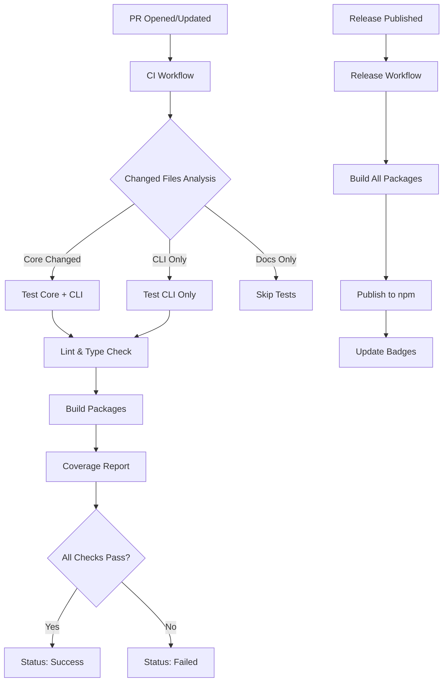

# Design Document - GitHub Actions CI/CD

## Overview

This document describes the design of a comprehensive CI/CD pipeline for the Kaiord monorepo using GitHub Actions. The pipeline implements intelligent change detection, parallel job execution, and automated publishing to npm. The design prioritizes speed, reliability, and developer experience while maintaining high code quality standards.

## Architecture

### Workflow Structure

The CI/CD system consists of four primary workflows:

1. **CI Workflow** (`ci.yml`) - Runs on every PR and push to main
2. **Release Workflow** (`release.yml`) - Runs when a GitHub release is published
3. **Security Audit** (`security.yml`) - Runs weekly and on dependency changes
4. **Changesets** (`changesets.yml`) - Manages version bumping and changelog generation

### High-Level Flow



## Components and Interfaces

### 1. CI Workflow (`ci.yml`)

**Purpose:** Validate code quality, run tests, and generate coverage reports on every PR and push to main.

**Triggers:**

- `pull_request` (opened, synchronize, reopened)
- `push` to `main` branch

**Jobs:**

#### Job: `detect-changes`

**Purpose:** Analyze git diff to determine which packages need testing

**Outputs:**

- `core-changed`: boolean indicating if @kaiord/core changed
- `cli-changed`: boolean indicating if @kaiord/cli changed
- `should-test`: boolean indicating if any tests should run

**Steps:**

1. Checkout code with full history (`fetch-depth: 0`)
2. Use `tj-actions/changed-files` action to detect changes
3. Analyze changed paths:
   - `packages/core/**` → set `core-changed=true`
   - `packages/cli/**` → set `cli-changed=true`
   - `package.json`, `pnpm-lock.yaml` → set both to `true`
   - Only docs/config → set `should-test=false`
4. Output results for downstream jobs

#### Job: `lint`

**Purpose:** Run ESLint and Prettier checks

**Depends on:** `detect-changes`

**Condition:** `needs.detect-changes.outputs.should-test == 'true'`

**Steps:**

1. Checkout code
2. Setup Node.js (version from matrix)
3. Setup pnpm with caching
4. Install dependencies: `pnpm install --frozen-lockfile`
5. Run ESLint: `pnpm lint`
6. Run Prettier check: `pnpm exec prettier --check .`

**Matrix:**

- `node-version: [20.x, 22.x]`

#### Job: `typecheck`

**Purpose:** Verify TypeScript types compile without errors

**Depends on:** `detect-changes`

**Condition:** `needs.detect-changes.outputs.should-test == 'true'`

**Steps:**

1. Checkout code
2. Setup Node.js
3. Setup pnpm with caching
4. Install dependencies
5. Run TypeScript compiler: `pnpm exec tsc --noEmit`

#### Job: `test`

**Purpose:** Run tests for affected packages with coverage

**Depends on:** `detect-changes`

**Condition:** `needs.detect-changes.outputs.should-test == 'true'`

**Strategy Matrix:**

- `node-version: [20.x, 22.x]`
- `package: [core, cli]`
- Exclude combinations based on `detect-changes` outputs

**Steps:**

1. Checkout code
2. Setup Node.js (version from matrix)
3. Setup pnpm with caching
4. Install dependencies
5. Build dependencies if needed:
   - If testing CLI and core changed: `pnpm --filter @kaiord/core build`
6. Run tests with coverage:
   - `pnpm --filter @kaiord/${{ matrix.package }} test:coverage`
7. Upload coverage to Codecov (only on Node 20.x)
8. Check coverage threshold (80%)
9. Upload coverage artifact

#### Job: `build`

**Purpose:** Verify packages build successfully

**Depends on:** `detect-changes`

**Condition:** `needs.detect-changes.outputs.should-test == 'true'`

**Steps:**

1. Checkout code
2. Setup Node.js
3. Setup pnpm with caching
4. Install dependencies
5. Build affected packages:
   - If core changed: `pnpm --filter @kaiord/core build`
   - If cli changed: `pnpm --filter @kaiord/cli build`
6. Upload build artifacts

### 2. Release Workflow (`release.yml`)

**Purpose:** Build and publish packages to npm when a release is created

**Triggers:**

- `release` (published)

**Jobs:**

#### Job: `publish`

**Purpose:** Build and publish packages to npm registry

**Steps:**

1. Checkout code
2. Setup Node.js with npm registry authentication
3. Setup pnpm with caching
4. Install dependencies: `pnpm install --frozen-lockfile`
5. Build all packages: `pnpm -r build`
6. Detect packages with version changes:
   - Parse `package.json` versions
   - Compare with published versions on npm
7. Publish changed packages:
   - `pnpm --filter @kaiord/core publish --access public --no-git-checks`
   - `pnpm --filter @kaiord/cli publish --access public --no-git-checks`
8. Create GitHub deployment
9. Update README badges

**Environment Variables:**

- `NODE_AUTH_TOKEN`: `${{ secrets.NPM_TOKEN }}`

**Secrets Required:**

- `NPM_TOKEN`: npm authentication token with publish permissions

### 3. Security Audit Workflow (`security.yml`)

**Purpose:** Scan dependencies for security vulnerabilities

**Triggers:**

- `schedule`: Weekly on Mondays at 9:00 AM UTC
- `pull_request`: When `package.json` or `pnpm-lock.yaml` changes
- `workflow_dispatch`: Manual trigger

**Jobs:**

#### Job: `audit`

**Purpose:** Run npm audit and report vulnerabilities

**Steps:**

1. Checkout code
2. Setup Node.js
3. Setup pnpm
4. Install dependencies
5. Run audit: `pnpm audit --audit-level=moderate`
6. Parse audit results
7. If high/critical vulnerabilities found:
   - Fail the workflow
   - Create GitHub issue with details
8. If moderate/low vulnerabilities found:
   - Pass with warning
   - Comment on PR with summary

### 4. Changesets Workflow (`changesets.yml`)

**Purpose:** Automate version bumping and changelog generation

**Triggers:**

- `push` to `main` branch

**Jobs:**

#### Job: `version`

**Purpose:** Create or update "Version Packages" PR

**Steps:**

1. Checkout code
2. Setup Node.js
3. Setup pnpm
4. Install dependencies
5. Run changesets version: `pnpm exec changeset version`
6. Create/update PR with version changes
7. If PR is merged:
   - Create GitHub release
   - Trigger release workflow

**Uses:** `changesets/action@v1` (latest: `v1.5.3`)

## Data Models

### Workflow Outputs

```typescript
type DetectChangesOutput = {
  coreChanged: boolean;
  cliChanged: boolean;
  shouldTest: boolean;
  affectedPackages: string[]; // ["core", "cli"]
};

type CoverageReport = {
  package: string;
  statements: number;
  branches: number;
  functions: number;
  lines: number;
  threshold: number;
  passed: boolean;
};

type AuditResult = {
  vulnerabilities: {
    info: number;
    low: number;
    moderate: number;
    high: number;
    critical: number;
  };
  totalDependencies: number;
  affectedPackages: string[];
};
```

### GitHub Actions Cache Keys

```typescript
type CacheKey = {
  pnpm: `pnpm-store-${runner.os}-${hashFiles('pnpm-lock.yaml')}`;
  nodeModules: `node-modules-${runner.os}-${hashFiles('pnpm-lock.yaml')}`;
  typescript: `typescript-${runner.os}-${hashFiles('tsconfig.json')}`;
};
```

## Error Handling

### Workflow Failures

**Strategy:** Fail fast with clear error messages

1. **Test Failures:**
   - Display failed test names in workflow summary
   - Upload test results as artifacts
   - Mark PR check as failed with link to logs

2. **Build Failures:**
   - Display TypeScript errors in workflow summary
   - Upload build logs as artifacts
   - Mark PR check as failed

3. **Lint Failures:**
   - Display ESLint/Prettier errors inline in PR
   - Provide auto-fix suggestions when possible
   - Mark PR check as failed

4. **Coverage Failures:**
   - Display coverage diff in PR comment
   - Highlight files below threshold
   - Mark PR check as failed

5. **Publish Failures:**
   - Create GitHub issue with error details
   - Send notification to maintainers
   - Rollback if partial publish occurred

### Retry Logic

**npm publish:** Retry up to 3 times with exponential backoff (5s, 10s, 20s)

**npm audit:** Retry up to 2 times if network error

**Codecov upload:** Retry up to 3 times with 5s delay

## Testing Strategy

### Workflow Testing

**Local Testing:**

- Use `act` tool to run workflows locally
- Test with sample PRs in feature branches
- Validate cache behavior

**Integration Testing:**

- Create test PRs with different change patterns
- Verify correct packages are tested
- Validate coverage reports
- Test publish workflow in dry-run mode

**Test Cases:**

1. **Core package changes:**
   - Verify both core and cli are tested
   - Verify both packages are built
   - Verify coverage for both packages

2. **CLI package changes only:**
   - Verify only cli is tested
   - Verify only cli is built
   - Verify coverage for cli only

3. **Documentation changes only:**
   - Verify no tests run
   - Verify no builds run
   - Verify workflow completes quickly

4. **Root dependency changes:**
   - Verify all packages are tested
   - Verify all packages are built
   - Verify full coverage report

5. **Release workflow:**
   - Verify packages build successfully
   - Verify npm authentication works
   - Verify only changed packages are published

## Performance Optimizations

### Caching Strategy

**pnpm Store Cache:**

- Key: `pnpm-store-${{ runner.os }}-${{ hashFiles('pnpm-lock.yaml') }}`
- Restore keys: `pnpm-store-${{ runner.os }}-`
- Expected speedup: 60-70% reduction in install time

**Node Modules Cache:**

- Key: `node-modules-${{ runner.os }}-${{ hashFiles('pnpm-lock.yaml') }}`
- Restore keys: `node-modules-${{ runner.os }}-`
- Expected speedup: 80% reduction in install time

**TypeScript Build Cache:**

- Key: `typescript-${{ runner.os }}-${{ hashFiles('tsconfig.json', 'packages/*/tsconfig.json') }}`
- Restore keys: `typescript-${{ runner.os }}-`
- Expected speedup: 40% reduction in build time

### Parallel Execution

**Independent Jobs:**

- `lint`, `typecheck`, `test`, `build` run in parallel
- Matrix strategy for multi-version testing
- Expected speedup: 50% reduction in total workflow time

**Conditional Execution:**

- Skip jobs when changes don't affect them
- Use `needs` and `if` conditions
- Expected speedup: 70% reduction for docs-only changes

### Target Performance

- **Full test suite:** < 5 minutes
- **Lint + typecheck:** < 2 minutes
- **Build:** < 3 minutes
- **Docs-only changes:** < 30 seconds
- **Publish workflow:** < 5 minutes

## Status Badges

### Badge Configuration

**CI Status Badge:**

```markdown
[](https://github.com/pablo-albaladejo/kaiord/actions/workflows/ci.yml)
```

**Coverage Badge:**

```markdown
[](https://codecov.io/gh/pablo-albaladejo/kaiord)
```

**npm Version Badges:**

```markdown
[](https://www.npmjs.com/package/@kaiord/core)
[](https://www.npmjs.com/package/@kaiord/cli)
```

**Badge Placement:**
Add badges to README.md after the existing hackathon badges.

## Security Considerations

### Secrets Management

**Required Secrets:**

- `NPM_TOKEN`: npm authentication token
  - Scope: Publish access to @kaiord/\* packages
  - Rotation: Every 90 days
  - Access: Repository secrets only

**Secret Usage:**

- Never log secrets in workflow output
- Use `${{ secrets.NAME }}` syntax only
- Mask secrets in error messages

### Dependency Security

**npm audit:**

- Run on every PR with dependency changes
- Fail on high/critical vulnerabilities
- Weekly scheduled scans

**Dependabot:**

- Enable automated dependency updates
- Auto-merge minor/patch updates
- Require review for major updates

### Workflow Permissions

**Minimal Permissions:**

```yaml
permissions:
  contents: read
  pull-requests: write
  issues: write
  checks: write
```

**Publish Workflow:**

```yaml
permissions:
  contents: write
  packages: write
```

## Monitoring and Observability

### Workflow Metrics

**Track:**

- Workflow duration (p50, p95, p99)
- Success rate by workflow
- Cache hit rate
- Test execution time by package
- Coverage trends over time

**Alerts:**

- Workflow failure on main branch
- Coverage drop > 5%
- Workflow duration > 10 minutes
- Cache miss rate > 20%

### Logging

**Workflow Logs:**

- Structured output with timestamps
- Group related steps
- Highlight errors and warnings
- Include context (commit SHA, PR number)

**Artifact Retention:**

- Test results: 30 days
- Coverage reports: 90 days
- Build artifacts: 7 days
- Logs: 90 days

## Migration Plan

### Phase 1: Basic CI (Week 1)

1. Create `ci.yml` with lint, typecheck, test jobs
2. Add pnpm caching
3. Configure status checks
4. Test with sample PRs

### Phase 2: Intelligent Change Detection (Week 1)

1. Implement `detect-changes` job
2. Add conditional job execution
3. Test with different change patterns
4. Optimize cache strategy

### Phase 3: Coverage and Security (Week 2)

1. Add coverage reporting with Codecov
2. Implement `security.yml` workflow
3. Configure coverage thresholds
4. Add badges to README

### Phase 4: Release Automation (Week 2)

1. Set up Changesets
2. Create `release.yml` workflow
3. Configure npm publishing
4. Test publish workflow in dry-run

### Phase 5: Monitoring and Optimization (Week 3)

1. Add workflow notifications
2. Implement performance monitoring
3. Optimize cache keys
4. Fine-tune parallel execution

## Dependencies

### GitHub Actions

- `actions/checkout@v4` - Checkout repository
- `actions/setup-node@v4` - Setup Node.js environment
- `pnpm/action-setup@v2` - Setup pnpm package manager
- `actions/cache@v3` - Cache dependencies and build outputs
- `tj-actions/changed-files@v40` - Detect changed files
- `codecov/codecov-action@v3` - Upload coverage reports
- `changesets/action@v1` - Manage versions and changelogs

### External Services

- **Codecov:** Coverage reporting and tracking
  - Free for open-source projects
  - Requires GitHub App installation
  - Provides coverage badges

- **npm Registry:** Package publishing
  - Requires npm account
  - Requires NPM_TOKEN secret
  - Public package access

## Alternative Approaches Considered

### 1. Turborepo for Monorepo Management

**Pros:**

- Built-in caching and task orchestration
- Automatic dependency graph analysis
- Remote caching support

**Cons:**

- Additional dependency and complexity
- pnpm already provides filtering
- Overkill for 2-package monorepo

**Decision:** Use pnpm's built-in filtering (`--filter`) for simplicity

### 2. CircleCI or Travis CI

**Pros:**

- Mature CI/CD platforms
- Advanced caching strategies
- Better UI for workflow visualization

**Cons:**

- External service dependency
- Additional cost for private repos
- Less integration with GitHub features

**Decision:** Use GitHub Actions for native integration and zero cost

### 3. Manual Version Management

**Pros:**

- Full control over versioning
- No additional tooling

**Cons:**

- Error-prone manual process
- Inconsistent changelog format
- Time-consuming

**Decision:** Use Changesets for automated, consistent versioning

## GitHub Templates

### Issue Templates

**Location:** `.github/ISSUE_TEMPLATE/`

#### 1. Bug Report (`bug_report.yml`)

**Purpose:** Standardize bug reports with required information

**Fields:**

- Title (required)
- Description (required)
- Steps to reproduce (required)
- Expected behavior (required)
- Actual behavior (required)
- Package affected (@kaiord/core, @kaiord/cli)
- Node.js version
- Operating system
- Additional context (optional)

**Labels:** Automatically add `bug`, `needs-triage`

#### 2. Feature Request (`feature_request.yml`)

**Purpose:** Collect feature requests with clear use cases

**Fields:**

- Title (required)
- Problem description (required)
- Proposed solution (required)
- Alternatives considered (optional)
- Package affected (@kaiord/core, @kaiord/cli)
- Additional context (optional)

**Labels:** Automatically add `enhancement`, `needs-triage`

#### 3. Documentation Issue (`documentation.yml`)

**Purpose:** Report documentation issues or improvements

**Fields:**

- Title (required)
- Documentation location (URL or file path)
- Issue description (required)
- Suggested improvement (optional)

**Labels:** Automatically add `documentation`

#### 4. Question (`question.yml`)

**Purpose:** Ask questions about usage or implementation

**Fields:**

- Title (required)
- Question (required)
- Context (optional)
- What you've tried (optional)

**Labels:** Automatically add `question`

### Pull Request Template

**Location:** `.github/pull_request_template.md`

**Purpose:** Ensure PRs include necessary information and follow contribution guidelines

**Sections:**

1. **Description:**
   - What does this PR do?
   - Why is this change needed?

2. **Related Issues:**
   - Closes #XXX
   - Relates to #XXX

3. **Type of Change:**
   - [ ] Bug fix (non-breaking change)
   - [ ] New feature (non-breaking change)
   - [ ] Breaking change
   - [ ] Documentation update
   - [ ] Refactoring
   - [ ] Performance improvement

4. **Checklist:**
   - [ ] Tests added/updated
   - [ ] Documentation updated
   - [ ] Changelog entry added (if applicable)
   - [ ] All tests passing
   - [ ] No linting errors
   - [ ] Coverage maintained/improved

5. **Testing:**
   - How was this tested?
   - Test coverage: X%

6. **Screenshots (if applicable):**
   - Before/after for CLI output changes

### Configuration Files

#### Issue Config (`.github/ISSUE_TEMPLATE/config.yml`)

**Purpose:** Add links to external resources

**Links:**

- Documentation: https://github.com/pablo-albaladejo/kaiord#readme
- Discussions: https://github.com/pablo-albaladejo/kaiord/discussions
- Kiro Community: https://kiro.dev

#### Code Owners (`.github/CODEOWNERS`)

**Purpose:** Automatically request reviews from code owners

**Rules:**

```
# Global owner
* @pablo-albaladejo

# Core package
/packages/core/ @pablo-albaladejo

# CLI package
/packages/cli/ @pablo-albaladejo

# Documentation
/docs/ @pablo-albaladejo
*.md @pablo-albaladejo

# CI/CD
/.github/ @pablo-albaladejo

# Specs
/.kiro/specs/ @pablo-albaladejo
```

#### Funding (`.github/FUNDING.yml`)

**Purpose:** Add sponsor links (optional for hackathon project)

**Content:**

```yaml
# github: pablo-albaladejo
# custom: ["https://buymeacoffee.com/pabloalbaladejo"]
```

### Dependabot Configuration

**Location:** `.github/dependabot.yml`

**Purpose:** Automate dependency updates

**Configuration:**

```yaml
version: 2
updates:
  # npm dependencies
  - package-ecosystem: "npm"
    directory: "/"
    schedule:
      interval: "weekly"
      day: "monday"
    open-pull-requests-limit: 5
    reviewers:
      - "pablo-albaladejo"
    labels:
      - "dependencies"
      - "automated"

  # GitHub Actions
  - package-ecosystem: "github-actions"
    directory: "/"
    schedule:
      interval: "weekly"
      day: "monday"
    open-pull-requests-limit: 3
    reviewers:
      - "pablo-albaladejo"
    labels:
      - "dependencies"
      - "github-actions"
```

## Bot Commit Detection

### Problem

When automated workflows (like auto-changeset) commit files to a PR, they trigger the CI workflows again, creating an infinite loop where:

1. PR is opened → auto-changeset runs → commits changeset
2. New commit triggers CI checks → they wait for status
3. But the checks are waiting for themselves to complete

### Solution

Add a condition to all CI jobs to skip execution when the commit is made by a bot:

```yaml
jobs:
  detect-changes:
    runs-on: ubuntu-latest
    # Skip if commit is from github-actions bot
    if: github.actor != 'github-actions[bot]'
    # ... rest of job
```

### Implementation

**Detection Method:**

- Check `github.actor` context variable
- Skip if actor is `github-actions[bot]`
- Apply to all jobs in CI workflow

**Affected Workflows:**

- `ci.yml` - All jobs should skip for bot commits
- Other workflows can continue normally

**Benefits:**

- Prevents infinite CI loops
- Saves CI resources
- Faster PR feedback for developers
- No impact on human commits

**Logging:**

Add a step to log when jobs are skipped:

```yaml
- name: Log bot commit skip
  if: github.actor == 'github-actions[bot]'
  run: |
    echo "Skipping CI jobs for bot commit"
    echo "Actor: ${{ github.actor }}"
    echo "Commit: ${{ github.sha }}"
```

## Future Enhancements

### Short-term (Next 3 months)

1. **E2E Testing:**
   - Add end-to-end tests for CLI
   - Test round-trip conversions with real files
   - Run in CI on every PR

2. **Performance Benchmarks:**
   - Track conversion performance over time
   - Fail if performance regresses > 10%
   - Display benchmark results in PR

3. **Docker Support:**
   - Create Docker images for CLI
   - Publish to GitHub Container Registry
   - Add Docker badge to README

### Long-term (Next 6 months)

1. **Multi-platform Testing:**
   - Test on Windows, macOS, Linux
   - Verify cross-platform compatibility
   - Add platform badges

2. **Canary Releases:**
   - Publish canary versions on every commit to main
   - Allow users to test latest features
   - Automated rollback on failures

3. **Visual Regression Testing:**
   - Add visual tests for CLI output
   - Detect formatting changes
   - Approve/reject visual diffs

## References

- [GitHub Actions Documentation](https://docs.github.com/en/actions)
- [pnpm Filtering](https://pnpm.io/filtering)
- [Changesets Documentation](https://github.com/changesets/changesets)
- [Codecov Documentation](https://docs.codecov.com/)
- [npm Publishing Guide](https://docs.npmjs.com/cli/v9/commands/npm-publish)
