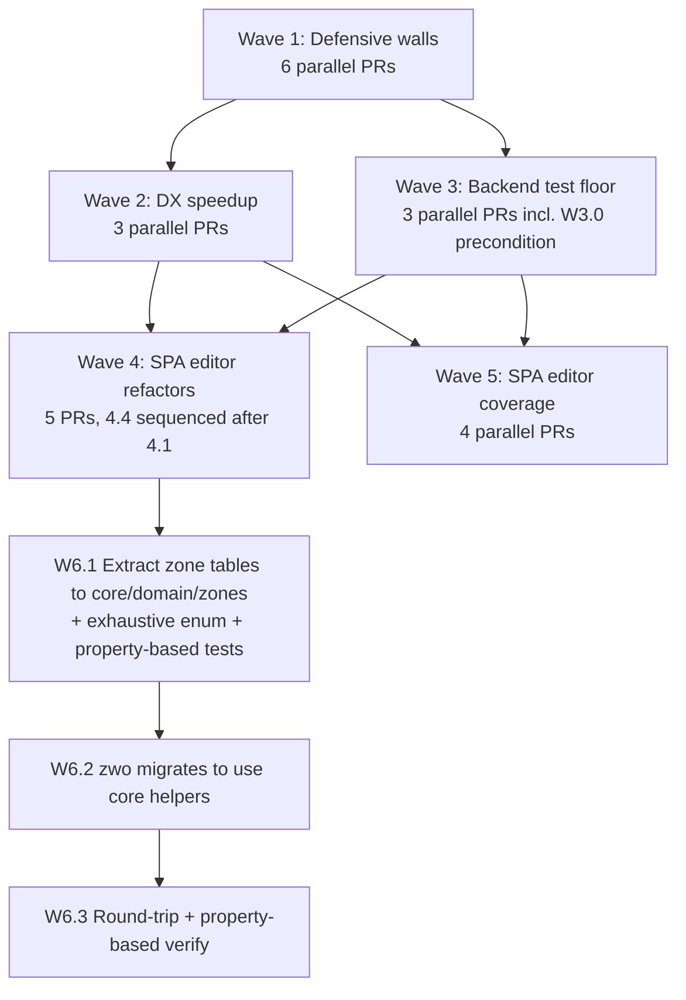

## Context

The audit conducted in the explore phase mapped current quality and DX hot spots across the kaiord monorepo. The structural baseline is healthy — strict TypeScript, hex arch enforced, zero skipped tests, no dead code, no legacy markers — but five categories of debt have accumulated:

1. **Mechanical guards configured but not enforced** (`size-limit`, `jscpd`).
2. **Sequential lint and pre-commit pipelines** that punish iteration speed.
3. **CI without per-job timeouts**, masking runaway jobs.
4. **Coverage gaps localized to specific layers**: organism-scoped hooks in `workout-spa-editor`, plus `core` and `garmin` packages below a 30 % test ratio.
5. **Oversized files and duplication clusters** in both the SPA editor (store-action mutations) and the format adapters (`zone↔watts`, `bpm↔%max`, pace-unit conversion replicated across `fit`, `tcx`, `zwo`).

This change is structured for autonomous execution under `/opsx-ship`: each work unit is a single PR, ownership is delegated to a specific subagent type, and the dependency graph is explicit so the orchestrator can dispatch ready PRs in parallel.

## Goals / Non-Goals

**Goals:**

- Drain the maintenance backlog in six sequenced waves with clear parallelization rules.
- Add or activate **detection** mechanisms (size-limit, jscpd, overrides-stale, CI timeouts) before doing any **refactor** so regressions surface immediately.
- Lift `core` and `garmin` test coverage to the project-mandated **80 %** line / branch / function (CLAUDE.md backend threshold). If the W3.0 baseline already shows the package at threshold, §3.1 / §3.2 are downgraded to no-op deferrals — the goal is "meet the bar," not "manufacture tests".
- Drop the SPA editor `hooks/`, `lib/`, and `store/` test ratios above the **70 %** frontend threshold (per CLAUDE.md), with priority on currently-untested organism hooks. **The 70 % vs 80 % asymmetry is intentional policy** — frontend hooks are accepted at a lower bar than backend domain logic; tightening to 80 % is a future tightening, not part of this change.
- Reduce SPA editor file-budget violations to zero (target: every file ≤ 100 LOC, every component ≤ 60 LOC, every other function ≤ 40 LOC).
- Extract cross-adapter conversion duplication into shared `core` domain helpers without breaking round-trip tolerances.
- Make every wave consumable by an autonomous subagent: each task names its agent, scope, acceptance check, and dependencies.

**Non-Goals:**

- No new product capability or user-facing feature.
- No accessibility, privacy, or GDPR work (those flow through their own streams).
- No bundle-size _reduction_ — we only **measure** via size-limit. If the ratchet fires, the response is a follow-up change.
- No release-cadence work. The 47 unconsumed changesets are out of scope; they are flagged in the audit but will not be touched here.
- No changes to the public API of any published package.
- No domain-spec changes other than the W1.5 extension of `scripts-folder-hygiene`.

## Decisions

### D1. Wave structure with explicit parallelization

Six waves. Within a wave, tasks are typed as **parallel** (no inter-task dependency) or **independent-PRs** (separate PRs but conceptually grouped). Between waves, hard sequencing applies:



W6 is **substantially narrower** than the original draft. See D2 ("W6 audit and rescope") for the code-inspection findings.

**Rationale.** Putting defensive walls (W1) first means W3–W6 cannot regress invariants without CI catching it. W2 follows W1 because the new pre-commit/lint shape will lean on the new CI jobs as the source of truth. W3 (backend tests) is parallel to W2 because they touch disjoint trees. W4 (SPA refactors) requires both W2 (fast inner loop while editing) and W3 (a stable backend baseline). **W5 runs in parallel with W4**, not after it: organism-hooks under `ZoneEditor`, `ProfileManager`, `WorkoutLibrary`, `WorkoutList` are NOT in W4's refactor scope (which touches `store/actions/`, `types/index.ts`, `CalendarPage`, store selectors, and 4 right-size files). Sequencing W5 after W4 would waste agent parallelism. W6 is last because — even after the W6 audit shrunk it — it still touches `core`'s public domain surface and a converter in `zwo`.

**Alternatives considered:**

- _One mega-PR per wave._ Rejected: too coarse-grained for `/opsx-ship` to dispatch in parallel; one stuck task blocks the entire wave.
- _Strictly serial waves._ Rejected: leaves >50 % of agent time idle; W3 has no real dependency on W2.
- _Flat task list, no waves._ Rejected: humans need the wave headlines to track progress; the orchestrator needs sequencing constraints expressed somewhere.

### D2. W6 audit and rescope (code-inspection findings)

The original draft claimed cross-adapter duplication of "zone↔watts, bpm↔%max, pace-unit conversion replicated across `fit`, `tcx`, `zwo`" with an estimated 10–15 % LOC reduction. **A code-inspection audit (recorded here for downstream agents) does not support that claim.** The actual landscape:

- **`packages/fit/src/adapters/target/power-helpers.ts`** uses `value − 1000` to extract absolute watts and `value − 100` to extract a percent — both Garmin SDK contract encodings, unique to the FIT format. Not duplicated logic.
- **`packages/zwo/src/adapters/target/power.converter.ts`** uses `* 100` to convert ZWO's `0.0–3.0` FTP fraction into KRD's `percent_ftp` integer. ZWO-specific arithmetic. Not duplicated logic.
- **`packages/tcx/src/adapters/target/...`** uses `Low/High` BPM bands directly with no offset transformation. Not duplicated logic.
- **`packages/zwo/src/adapters/target/power.converter.ts:56` — `convertPowerZoneToPercentFtp`** — is the lone exception. The 7-band mapping `zone → percent FTP` is fitness-domain truth (it expresses how cycling coaches define training intensity), not Zwift-specific encoding. It currently lives only in `zwo` and is duplicated in spirit (not in code) wherever a UI surfaces "zone 4 = 105 % FTP".

**Decision.** W6 is reduced from 5 PRs to 3:

- **W6.1** — extract the zone table into `packages/core/src/domain/zones/power-zones.ts` (and any HR equivalent the agent's audit confirms). Implementation includes exhaustive zone enumeration tests AND property-based tests via `fast-check` for round-trip idempotency across all valid zones. Coverage requirement: ≥ 95 % per file (helpers are pure — there is no excuse).
- **W6.2** — `zwo` adapter migrates its `power.converter.ts:56` import to the new core helper. Other zwo logic stays put.
- **W6.3** — round-trip + property-based verification across the migrated state. Acceptance is `pnpm -r test:roundtrip` PLUS a new `pnpm test --filter @kaiord/core -- conversions` showing the property-based suite green.

**FIT and TCX adapters are NOT touched by W6** because they hold no equivalent domain artifact. The W6.1 PR description includes a grep audit (`grep -RnE "<zone-table-fingerprint>" packages/`) confirming no other site needs migrating; if the audit surfaces an unexpected cross-adapter site, that finding is folded into W6.2 rather than spawning new tasks.

**Sub-agent contract.** The architect agent dispatched for W6.1 MUST treat the zone-table claim as a hypothesis — verify it via grep before extracting. If the hypothesis fails (e.g. additional or different cross-adapter math is found), the agent surfaces the discrepancy in the PR description and halts; it does NOT silently broaden scope.

### D3. Subagent assignment per task type

Each task names exactly one agent type so `/opsx-ship` does not have to decide:

| Task family                                     | Agent                   | Why                                                              |
| ----------------------------------------------- | ----------------------- | ---------------------------------------------------------------- |
| CI workflow / size-limit / jscpd / timeouts     | `cicd-guardian`         | Owns `.github/workflows/**`, knows pipeline shape.               |
| Hook config (pre-commit, pre-push)              | `cicd-guardian`         | Same scope (DX wiring).                                          |
| Missing READMEs / docs drift                    | `docs-expert`           | Owns documentation tone and structure.                           |
| Test coverage lifts                             | `test-improver`         | Existing autonomous test-coverage improver.                      |
| Oversized file splits / function extraction     | `complexity-reducer`    | Existing autonomous complexity reducer.                          |
| `lint:overrides-stale` script + delta spec edit | `general-purpose`       | Cross-cutting (script + spec + root `package.json`).             |
| Cross-adapter helper extraction (W6)            | `architecture-guardian` | Touches domain layer + three adapters; needs hex-arch awareness. |
| Round-trip verification (W6.5)                  | `validate-roundtrip`    | Existing roundtrip validator.                                    |
| SPA bundle env-agnosticism (W1.6)               | `spa-expert`            | React/Vite expert; owns `workout-spa-editor` runtime patterns.   |

### D4. Acceptance check shape

Every task has a single command (or two-command sequence) that an agent or human can run to prove the task is complete. No subjective acceptance. Examples:

- W1.1 (size-limit in CI): `gh workflow view ci.yml | grep -q size-limit` **and** the next CI run shows a "size-limit" check.
- W3.1 (core test ratio): `node scripts/compute-test-ratio.mjs packages/core` reports ≥ 30 % (this script is one of W1's optional deliverables — see Open Questions).
- W6.5 (round-trip): `pnpm -r test:roundtrip` passes within current tolerances.

When an acceptance check requires a script that does not yet exist (e.g. `compute-test-ratio.mjs`), the task lists creating that script as a pre-step. Agents handle this without re-asking.

### D5. Capability deltas: one Modified, one New

**Modified — `scripts-folder-hygiene`.** W1.5 extends it with a new mechanical-guard requirement: every entry in root `package.json#pnpm.overrides` SHALL be checked against the upstream version range and flagged when the upstream now satisfies the patched range without the override. The new check is `scripts/check-overrides-stale.mjs` (rule ID `R-OverridesStale`) wired into `pnpm test:scripts`. The delta spec specifies the algorithm precisely (deterministic, network-fail-closed) and includes scenarios for required, stale, allowlisted, malformed, empty/absent, and offline-CI conditions.

**New — `domain-conversions`.** W6.1 introduces `packages/core/src/domain/zones/` as a stable home for fitness-domain zone tables (initially the 7-band power-zone table). Adding new public exports under a brand-new directory inside `core/src/domain/` is a spec-level event: the helpers' contract (signatures, valid input ranges, error semantics, purity guarantee) becomes part of `@kaiord/core`'s API surface. The capability spec encodes that contract and the constraint that any future side-effectful behavior MUST migrate to `application/`, never live under `domain/`.

**Rationale.** Every other wave is internal refactor, test addition, or CI plumbing — none of which alter system behavior in a spec-relevant way. Lint parallelization (W2.2) is observable behavior in some workflows but not enough to justify a capability spec; we accept a small parity risk and trust the W2.2 PR to document any ordering it preserves.

### D6. Hexagonal layer impact

- **Domain (`core/src/domain/`)**: Wave 6 adds `core/src/domain/zones/` — pure constants and conversion helpers for fitness zone tables (initially power; HR if the W6.1 audit confirms a duplicated table). No external imports beyond `zod`, no I/O. Architecture remains `domain depends on nothing`.
- **Application (`core/src/application/`)**: untouched. **Rule for future work:** if any helper in `domain/zones/` later needs side-effects (e.g. fetching an athlete-specific zone profile from storage), the work migrates to `application/` with an injected port — it does NOT acquire I/O while remaining under `domain/`. The `domain-conversions` spec encodes this constraint.
- **Ports**: no new ports.
- **Adapters**: `zwo`'s `power.converter.ts` imports the new domain helper. This is a strict inward dependency, so hex arch is preserved. **`fit` and `tcx` are NOT touched by Wave 6** because their format-specific encodings (FIT's `value+1000`, TCX's BPM bands) are not domain truths and stay in their respective adapters.
- **Infrastructure**: no changes.

### D7. Dependency additions

- `lint-staged` (devDependency, root only): required by W2.1.
- `npm-run-all2` (devDependency, root only): required by W2.2. **Chosen over `concurrently`** (less ANSI interleaving noise on aggregate-output) **and over `turbo run`** (avoids introducing a new build orchestrator surface in a maintenance change). Invoked with `--max-parallel=4 --aggregate-output`. The literal `4` is calibrated for GitHub-hosted `ubuntu-latest` runners (2 vCPUs, 7 GB RAM): with 17 lint sub-scripts, allowing more than 4 concurrent processes risks RAM pressure on the runner during the heaviest checks (`lint:specs` runs `openspec validate` which loads every spec into memory). Developer laptops have more cores; if developers prefer to override locally, the cap can be made env-driven in a follow-up. `--aggregate-output` keeps per-process output contiguous so a CI failure log is grep-able.
- `fast-check` (devDependency, root only): required by W6.1 for property-based tests on the zone helpers.
- `size-limit` and `@size-limit/file` are already devDependencies. W1.1 only wires them into CI.

No runtime dependencies added to any published package.

### D8. Failure modes and rollback

Each PR is independently revertible. Because every wave's PRs are scoped to disjoint files (verified by the pairwise file-overlap audit recorded in tasks.md), a `git revert` on any single PR does not break the others. The only ordering constraint at revert time is: if W6.1 (helpers added in core) is reverted, W6.2 (zwo migration) must also be reverted because it imports the helpers.

**Kill-switches.** Mirroring the precedent from `2026-05-03-repo-hygiene-tooling`, both new CI gates (W1.1 size-limit, W1.2 jscpd) ship with a repository-variable kill-switch (`SIZE_LIMIT_BOT_ENABLED`, `JSCPD_BOT_ENABLED`). The job-level `if:` checks evaluate `vars.<NAME> != 'false'` so a single GitHub UI toggle disables either gate without code changes — guarding against the case where a regression on `main` blocks every PR.

### D9. SPA editor: runtime config injection (12-factor III + V)

Audit of the SPA against the twelve-factor methodology surfaced one violation that touches **five surfaces**, not one. A grep audit (`grep -RnE "VITE_CF_ANALYTICS_TOKEN" packages/workout-spa-editor/`) shows:

1. `packages/workout-spa-editor/src/main.tsx:21` — `import.meta.env.VITE_CF_ANALYTICS_TOKEN` (the call site).
2. `packages/workout-spa-editor/index.html:59` — `data-cf-beacon='{"token": "%VITE_CF_ANALYTICS_TOKEN%"}'` (a Vite template-token replaced at build time).
3. `packages/workout-spa-editor/vite.config.ts:20,31` — `conditionalBeacon(env.VITE_CF_ANALYTICS_TOKEN)` and the `replace(/%VITE_CF_ANALYTICS_TOKEN%/g, ...)` call that performs the build-time substitution.
4. `packages/workout-spa-editor/e2e/spa-route-refresh.spec.ts:34` — sets the env var when launching the e2e dev server.
5. `packages/workout-spa-editor/docs/analytics.md` — documents the build-time embed approach.

All five must change for the bundle to be truly environment-agnostic. Two consequences of the current state:

- **Factor III (config in env, not code)**: an environment-specific value lives inside the compiled artifact.
- **Factor V (build/release/run separation)**: the bundle is no longer environment-agnostic — a different deploy environment requires a different build.

W1.6 decouples this by moving the analytics token to a runtime source. The agent picks the lightest viable mechanism among:

1. **`/config.json` fetched on startup** — written to the static origin at deploy time, read by `main.tsx` before initializing analytics. Closest to the canonical 12-factor SPA pattern.
2. **`window.__KAIORD_CONFIG__` injected via index.html** — a `<script>` tag in `index.html` is templated at deploy time. Lightweight; no extra HTTP round trip.
3. **Cloudflare-side script tag** — Cloudflare Web Analytics natively supports including its `<script>` from the CF dashboard rather than from app code; the cleanest answer if the team is willing to manage the snippet outside the app.

The agent chooses based on the existing deploy machinery (whichever option requires the fewest moving parts). The acceptance check is shape-only: `main.tsx` MUST NOT import or reference the value via `import.meta.env`, and the minified bundle MUST NOT contain the literal token of any specific environment.

**Out of scope for W1.6**: the other `import.meta.env` references (`MODE`, `DEV`, `BASE_URL`) are Vite intrinsics that legitimately encode "this is a dev vs production build" — a build-time question, not a deploy-time question. They are 12-factor-compliant and stay.

**Other 12-factor surfaces audited and found clean** (no work required):

- `core`, `fit`, `tcx`, `zwo`, `garmin`, `ai`, `mcp` — zero `process.env` reads in source. Pure libraries.
- `cli` — reads only `CI`, `NODE_ENV`, `FORCE_COLOR`. Standard 12-factor-correct usage.
- `garmin-connect` — one hardcoded URL (`https://connect.garmin.com/...`) is a contract endpoint, not config (factor IV is N/A for service contracts).
- 50+ `console.*` calls in `cli`/`mcp`/`garmin-connect` — factor XI (logs as event streams) already satisfied.

### D10. Lint umbrella ordering matrix (W2.2 input)

`pnpm lint` chains 17 sub-scripts with `&&` (root `package.json:55`). W2.2 parallelizes them via `npm-run-all2 -p --max-parallel=4 --aggregate-output`. Pre-computing the ordering matrix here means the W2.2 PR ships from a known shape, not from agent-side investigation.

**Sequential-required (post group; must run after the rest):**

- `lint:archive-index` ← depends on `lint:archive` having validated the archive folder shape; the index reflects folder state.
- `lint:archive-followups` ← same dependency on `lint:archive` (both read archive-folder structure).

**Independent (parallel group):**

- `lint:archive`, `lint:specs`, `lint:tsup-watchdog`, `lint:mapper-no-tests`, `lint:converter-has-tests`, `lint:husky-no-bypass`, `lint:package-deps`, `lint:architecture`, `lint:no-unconditional-skip`, `lint:no-library-dual-mount`, `lint:allowlists-empty`, `lint:icons-distinct`, `lint:build-portable`, `lint:ci-fanout`, `lint:scripts-orphans` (15 checks).
- Plus the new `lint:overrides-stale` (W1.5) and `lint:workflow-timeouts` (W1.3) — both independent.

**Per-package `pnpm -r lint` step:** stays as-is in its current position (eslint + prettier + tsc per package). It is implicitly parallel via pnpm's recursive workspace runner.

**Composition:** `run-s ( run-p [parallel-group] ) ( run-p lint:archive-index lint:archive-followups )`. The outer `run-s` enforces the post-group ordering. The W2.2 PR description echoes this matrix so reviewers can verify it matches design.md.

### D11. Pairwise file-overlap audit (input for /opsx-ship)

For each wave with multiple parallel PRs, the dispatching agent runs a pairwise `git diff --name-only` audit before dispatching. Two PRs in the same wave with overlapping file scopes must be serialized via a `Depends on:` marker in tasks.md. Pre-computed findings:

- **W1**: all 6 PRs touch disjoint trees (CI workflows, READMEs, root package.json + scripts/, SPA editor src+config). No serialization needed.
- **W2**: 3 PRs all touch root files. W2.1 edits `.husky/pre-commit` and root `package.json`. W2.2 edits root `package.json` (`scripts.lint` only). W2.3 edits `.husky/pre-push` only. W2.1 and W2.2 both touch `package.json` — serialize: **W2.2 Depends on W2.1** (W2.1's lint-staged config block is added first; W2.2 then rewrites `scripts.lint`).
- **W3**: 3 PRs touch disjoint packages (`packages/core`, `packages/garmin`, plus the W3.3 file-split set in `fit`/`tcx`/`zwo`/`cli`). W3.0 (compute-test-ratio script, see D12) is a precondition for W3.1 and W3.2.
- **W4**: 5 PRs in `workout-spa-editor`. **W4.1 (`store/actions/`) and W4.4 (selector registry)** both touch `store/`. W4.4 Depends on W4.1 (already encoded). W4.2 (types/index.ts split) touches every import site that pulls from `~/types` — including files the other W4 PRs touch. **W4.2 should land FIRST** in W4 to minimize merge conflicts; encode by making W4.3, W4.4, W4.5 all `Depends on: W4.2`.
- **W5**: 4 PRs in disjoint `organisms/<X>/hooks` subtrees. No serialization needed.
- **W6**: 3 PRs already strictly sequenced.

### D12. W3.0 precondition: `compute-test-ratio.mjs` (resolved Open Question OQ1)

W3.1 and W3.2 acceptance use a coverage threshold (see tasks.md), not a file-count ratio. The earlier file-count proxy was abandoned because (a) it counts fixtures and `.types.ts` files in the denominator, inflating it, and (b) it does not correlate with real coverage. **OQ1 is therefore resolved as: do not add `compute-test-ratio.mjs`. Use vitest coverage instead.** The W3.1 and W3.2 acceptance commands invoke `pnpm --filter @kaiord/<pkg> test:coverage` directly.

### D13. `/opsx-ship` orchestration contract

**Pre-dispatch parser smoke (NOT a numbered task; runs once inside the orchestrator before the first PR opens).**

Before dispatching ANY PR for this change, `/opsx-ship` MUST execute the following parser-shape assertion against `openspec/changes/repo-quality-maintenance-waves/tasks.md`:

```js
import { readFileSync } from "node:fs";
const md = readFileSync(
  "openspec/changes/repo-quality-maintenance-waves/tasks.md",
  "utf8"
);
const tasks = [...md.matchAll(/^## §(\d+\.\d+)\s+(.*)$/gm)].map((m) => ({
  id: m[1],
  title: m[2],
}));
const ids = new Set(tasks.map((t) => t.id));
const errors = [];
for (const t of tasks) {
  const block = md.split(`## §${t.id}`)[1].split(/^## §/m)[0];
  const dep = (block.match(/\*\*Depends on:\*\*\s*(.*)/) || [, ""])[1].trim();
  const agent = (block.match(/\*\*Agent:\*\*\s*(.*)/) || [, ""])[1].trim();
  const scope = (block.match(/\*\*Scope:\*\*/) || [])[0];
  const accept = (block.match(/\*\*Accept:\*\*/) || [])[0];
  if (!agent) errors.push(`§${t.id}: missing **Agent:**`);
  if (!scope) errors.push(`§${t.id}: missing **Scope:**`);
  if (!accept) errors.push(`§${t.id}: missing **Accept:**`);
  if (!dep) errors.push(`§${t.id}: missing **Depends on:**`);
  if (dep && dep !== "none") {
    for (const id of dep.split(/,\s*/).map((s) => s.replace(/^§/, ""))) {
      if (!ids.has(id)) errors.push(`§${t.id}: unknown dependency §${id}`);
    }
  }
}
if (errors.length) {
  console.error(errors.join("\n"));
  process.exit(1);
}
console.log(`OK: ${tasks.length} tasks, all dependencies resolve`);
```

If the script exits non-zero, the orchestrator MUST halt and surface the error list to the user. **No PR opens until tasks.md parses cleanly.** This replaces the previous §0.0-as-a-PR design (rejected: a 23-PR plan cannot have a single PR as a precondition for the other 22 — too brittle, and §0.0 had no source-code deliverable to review).

**Dispatch order.** The orchestrator MUST:

1. Parse `tasks.md` and discover the dependency markers `Depends on: <task-id>` (one per task).
2. Treat tasks with no unmet dependency as **ready**.
3. Dispatch all ready tasks in parallel, each in its own worktree, each as its own PR.
4. When a PR merges into `main`, mark the task complete and re-evaluate readiness.
5. Stop only when all tasks are merged.

Tasks within the same wave that have no `Depends on:` line are parallel-safe. Tasks in different waves with cross-wave dependencies use explicit `Depends on: §X.Y` lines.

## Risks / Trade-offs

- **[Risk]** Wave 1.5 (overrides audit) may discover overrides that _cannot_ be safely removed (transitively required by old upstreams). → **Mitigation:** the new `R-OverridesStale` rule includes an allowlist mechanism (analogous to the existing scripts-folder allowlist) so a justified override stays, with a one-line "Why kept" note.
- **[Risk]** Wave 2.2 (parallelizing `pnpm lint`) may surface implicit ordering between checks (e.g. archive-index expects archive-dates to have run first). → **Mitigation:** introduce two parallel groups: an _independent_ group and a _post_ group, sequenced by `npm-run-all2`. The agent identifies the post group by reading each check's `--help` or source.
- **[Risk]** Wave 4 refactors land before Wave 5 tests are added, leaving an undertest window. → **Mitigation:** the existing organism-hooks coverage is already 0 %, so refactoring without new tests does not strictly worsen the situation, and the W4 PRs MUST include round-trip-style smoke tests. The deeper coverage lift is W5.
- **[Risk]** Wave 6 changes the call signature of conversion helpers and introduces tolerance drift. → **Mitigation:** W6.5 is a closing PR that runs `pnpm -r test:roundtrip` and gates on existing tolerances (`time ±1s, power ±1W or ±1%FTP, HR ±1bpm, cadence ±1rpm`). If any tolerance fails, W6.5 cannot merge.
- **[Trade-off]** Six waves means the change ships across many PRs (~27). A one-shot bundle would be smaller in calendar time but unreviewable. We accept the multi-PR overhead because each PR stays scoped, reviewable, and revertible.
- **[Trade-off]** Adding `lint-staged` and `npm-run-all2` increases dev dependency surface. Both are well-maintained, MIT-licensed, and add zero runtime cost.

## Migration Plan

No public-API migration required. Internal callers of `fit`, `tcx`, `zwo` target converters are untouched: the converter signatures remain stable; only their internals change in W6.

For consumers of the SPA editor (browser), Wave 4 is internal-only and ships behind no flag. The Wave 4 PRs MUST be smoke-tested against the canonical workout fixture before merge (existing test infrastructure handles this).

## Open Questions

- **OQ1.** Should Wave 1 include a one-off `scripts/compute-test-ratio.mjs`? **Resolved (D12)**: no. W3.1 and W3.2 use vitest coverage thresholds, not a file-count ratio.
- **OQ2.** When parallelizing `pnpm lint` (W2.2), does any existing check have hidden ordering with another? **Resolved (D10)**: yes. `lint:archive-index` and `lint:archive-followups` post-depend on `lint:archive`. The other 15 are independent.
- **OQ3.** Does `garmin` need an HR-zone domain helper extracted alongside the power-zone one? **Open**: the W6.1 audit determines this. If no HR-zone duplication is found, W6.1 ships only the power-zone helper and the `domain-conversions` spec is correspondingly minimal.

These are tactical choices the agents may resolve in-PR; they do not block dispatch.
