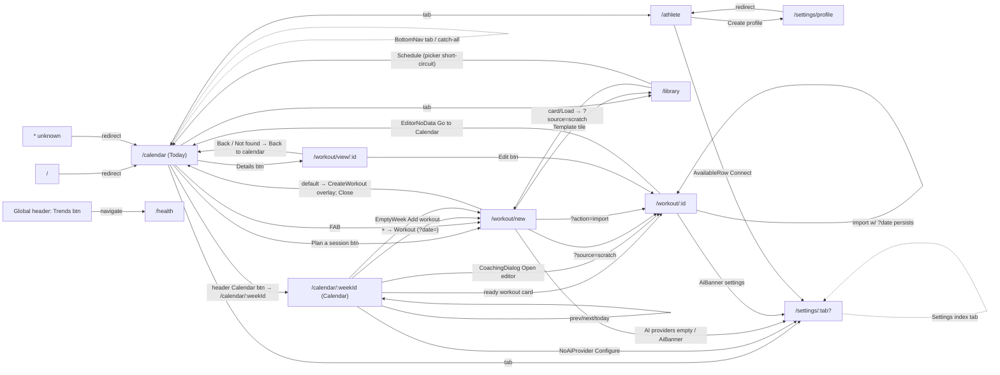
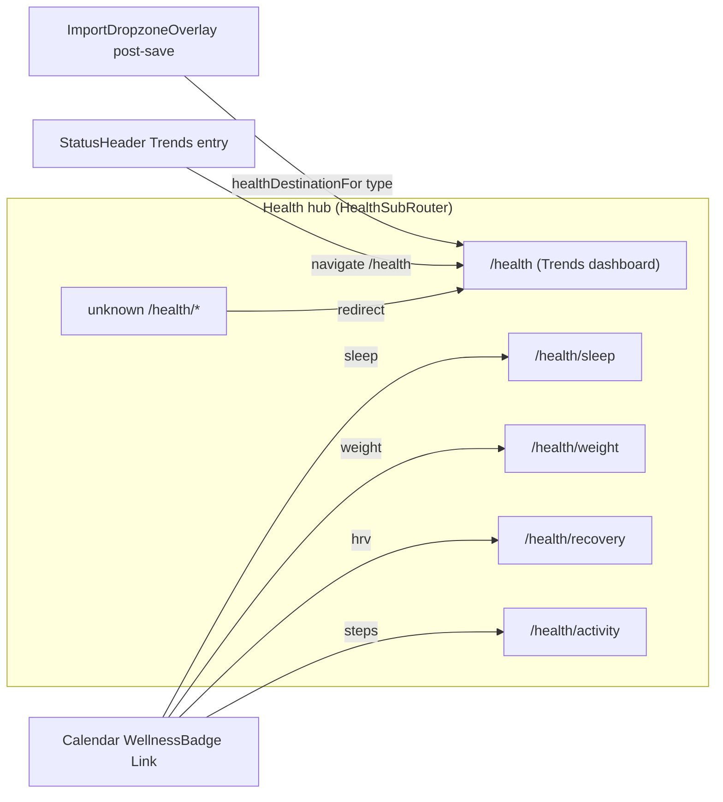
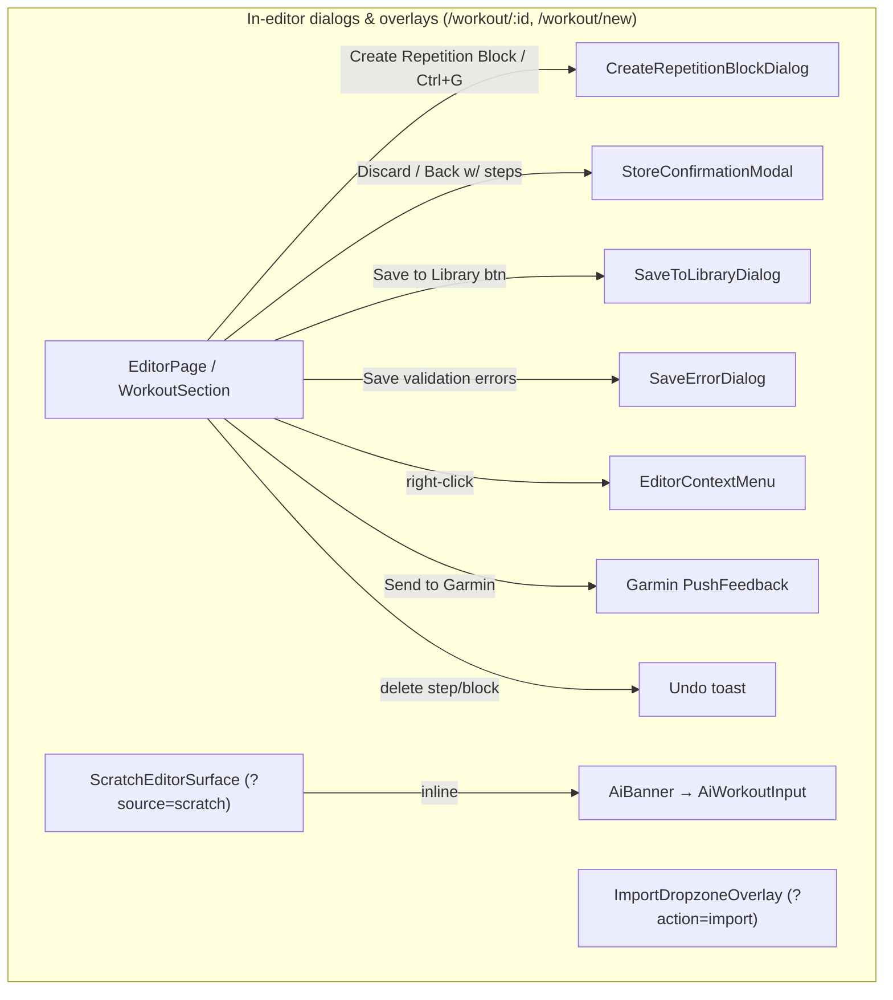

# Workout SPA Editor — Navigation & Layout Map

@kaiord/workout-spa-editor is a private React SPA in the Kaiord monorepo. Routing is **wouter** (`<Switch>` in `AppRoutes.tsx`); layout is **Tailwind** (mobile-first, breakpoints sm=640/md=768/lg=1024/xl=1280); persisted data flows through **Dexie.js + `useLiveQuery`** (one query per page) while editor runtime lives in a single **Zustand** `workout-store`. The app follows a hexagonal split (`app/` UI over `adapters/` for KRD/FIT/TCX/ZWO/GCN). Every route is wrapped by `MainLayout` global chrome (sticky header + mobile-only bottom nav); KRD is the canonical workout format that all import/export passes through.

## Route table

| Route pattern       | Component (file)                                                     | Params / Query                                          | Notes                                                                                                      |
| ------------------- | -------------------------------------------------------------------- | ------------------------------------------------------- | ---------------------------------------------------------------------------------------------------------- |
| `/`                 | — (`AppRoutes.tsx`)                                                  | —                                                       | **Redirect → `/calendar`**                                                                                 |
| `/calendar`         | `TodayPage` (`components/pages/Today/Today.tsx`)                     | —                                                       | **Renders Today, NOT CalendarPage.** App skips no nav here; this is the app landing surface                |
| `/calendar/:weekId` | `CalendarPage` (`components/pages/CalendarPage.tsx`)                 | `weekId`                                                | The week grid/list. Invalid `weekId` → **Redirect `/calendar`**                                            |
| `/athlete`          | `AthletePage` (`components/pages/AthletePage/AthletePage.tsx`)       | —                                                       | Gates on active profile (spinner / empty / body)                                                           |
| `/library`          | `LibraryPage` (`components/pages/LibraryPage.tsx`)                   | `?source=template-picker`, `?date=YYYY-MM-DD`           | `source=template-picker` switches Schedule to direct-schedule short-circuit                                |
| `/workout/new`      | `NewWorkoutRoute` (`new-workout-route.tsx`)                          | `?action=import`, `?source=scratch`, `?date=YYYY-MM-DD` | **Dispatcher:** default → CreateWorkout overlay; `action=import` OR `source=scratch` → EditorPage directly |
| `/workout/view/:id` | `WorkoutDetail` (`components/pages/WorkoutDetail/WorkoutDetail.tsx`) | `id`                                                    | Read-only sheet; loads Dexie record without hydrating Zustand                                              |
| `/workout/:id`      | `EditorPage` (`components/pages/EditorPage.tsx`)                     | `id`                                                    | Structured editor (edit mode); hydrates workout-store                                                      |
| `/settings/profile` | — (`AppRoutes.tsx`)                                                  | —                                                       | **Redirect → `/athlete`** (declared above `/settings/:tab?` so it wins)                                    |
| `/settings/:tab?`   | `SettingsPage` (`components/pages/SettingsPage/SettingsPage.tsx`)    | `tab?` ∈ ai\|sync\|extensions\|usage\|privacy           | No tab → grouped list. Unknown tab → **Redirect `/settings`**                                              |
| `/health/*?`        | `HealthSubRouter` (`components/pages/health/health-routes.tsx`)      | trailing path                                           | Sub-router: `/health`, `/sleep`, `/weight`, `/recovery`, `/activity`. Unknown → **Redirect `/health`**     |
| (catch-all)         | — (`AppRoutes.tsx`)                                                  | —                                                       | **Redirect → `/calendar`**                                                                                 |

## Navigation graph

## Global chrome

Defined in `components/templates/MainLayout/MainLayout.tsx`; wraps **every** route. Root is `flex min-h-screen flex-col`.

- **LayoutHeader** (`LayoutHeader.tsx`) — **sticky top-0 z-50**, present on every route. Contains `HeaderLogo` (brand `<Link href="/calendar">`, left) + `StatusHeader` (right): primary nav buttons (Calendar → `/calendar/:weekId`, Library → `/library`, Trends → `/health`, New → `/workout/new`), `StatusIndicators` (Garmin / Train2Go pills, display-only), `ProfileEntryButton` (→ `/settings/profile`, redirects to `/athlete`), Settings (→ `/settings/ai`), a **Help** button (→ lazy `HelpDialog`), and `ThemeToggle`. Responsive: inner bar is `flex-col items-center gap-2` on mobile, `sm:flex-row sm:gap-4` on desktop; entry-button labels are `hidden sm:inline` (only "New workout" keeps its label on mobile); the nav↔indicator divider is `hidden sm:inline-block`.
- **BottomNav** (`components/molecules/BottomNav/BottomNav.tsx`) — **MOBILE ONLY** (`md:hidden`), fixed floating glass bar (`inset-x-[14px] bottom-[14px] z-30`, `max-w-md`, rounded). **4 tabs** from `BOTTOM_NAV_TABS`: Today → `/calendar`, Library → `/library`, Athlete → `/athlete`, Settings → `/settings`; plus a center notch **FAB** → `/workout/new` (`CREATE_WORKOUT_PATH`). `isTabActive` sets `aria-current` (Today active on `/` too; Settings active on any `/settings` prefix). **Desktop has NO bottom nav** — navigation is the header button row only.
- **`<main>`** — `mx-auto w-full max-w-7xl flex-1 overflow-x-hidden px-4 py-6 pb-28 sm:px-6 lg:px-8 md:pb-6`. The `pb-28` clears the floating bottom nav on mobile; `md:pb-6` on desktop.
- **StorageAvailabilityBanner** (`molecules/StorageAvailabilityBanner`) — `role="alert"` above `<main>`, renders only when storage-store status === `failed`.
- **Route announcer** — sr-only `aria-live="polite"` label from `useRouteAnnouncerLabel`; `useFocusOnRouteChange` moves focus to `[data-route-heading]` on each pathname change (MutationObserver up to 5s, else `document.body`).
- **Global non-visual / overlay chrome** (App.tsx siblings of MainLayout): `MigrationBoot` (v10 migration toast), `AppKeyboardShortcuts` (editor-store save/undo/redo/copy/paste/group — **not navigation**), and `AppTutorial` → lazy `OnboardingTutorial` (Radix dialog, 6 centered steps, auto-shows on first visit unless `?e2e=true`/`?skipTutorial=true`/`window.__PLAYWRIGHT__`; replayable from HelpDialog).

**Desktop vs mobile chrome difference:** desktop = sticky header button row, no bottom nav, `main` with `md:pb-6`. Mobile = header stacks (`flex-col`) with collapsed labels, plus the floating BottomNav + FAB and `main` `pb-28`.

## Screens

### `/calendar` — Today

|              |                                                                                                                                                                            |
| ------------ | -------------------------------------------------------------------------------------------------------------------------------------------------------------------------- |
| Route        | `/calendar` (renders **Today**, not Calendar)                                                                                                                              |
| Renders      | `components/pages/Today/Today.tsx` (lazy `TodayPage`)                                                                                                                      |
| Header       | Global sticky header + page `TodayHeader` (date eyebrow + "Today" h1 route-heading + inert Notifications bell)                                                             |
| Bottom nav   | Visible (mobile)                                                                                                                                                           |
| Responsive   | **No distinct layouts** — single mobile-first stack (`space-y-6 px-4`) at all widths; zero `sm:/md:/lg:` prefixes in Today components                                      |
| Sub-views    | Planned session card (workout exists today) / Planned empty state                                                                                                          |
| Dialogs      | None                                                                                                                                                                       |
| Outgoing nav | `/workout/new` (PlannedEmpty "Plan a session"); `/workout/view/:id` (PlannedSessionCard "Details"); Garmin push (PushButton — in-place idle→pushing→done, no route change) |

### `/calendar/:weekId` — Calendar week

|              |                                                                                                                                                                                                                                                                                                                                        |
| ------------ | -------------------------------------------------------------------------------------------------------------------------------------------------------------------------------------------------------------------------------------------------------------------------------------------------------------------------------------- |
| Route        | `/calendar/:weekId` (param `weekId`)                                                                                                                                                                                                                                                                                                   |
| Renders      | `components/pages/CalendarPage.tsx` → `CalendarPageView`                                                                                                                                                                                                                                                                               |
| Header       | Global header + `CalendarHeader` (empty/processing banners + BatchCostConfirmation, WeekNavigation row, CalendarViewToggle, per-source CoachingSyncButton); sr-only "Calendar" h1                                                                                                                                                      |
| Bottom nav   | Visible (mobile)                                                                                                                                                                                                                                                                                                                       |
| Responsive   | **Distinct** (sm 640 / md 768). Grid view: mobile = horizontal snap-scroll of 7 day cards (`min-w-[140px]`, sticky day-name header `hidden sm:grid`), desktop = `sm:grid-cols-7`. Default view pref seeded by `innerWidth>=768` ("grid") else "list". Drag-to-reschedule wired **only in Grid** and gated `>=768px` (200ms touch hold) |
| Sub-views    | Week Grid view / Week List view; loading Skeleton                                                                                                                                                                                                                                                                                      |
| Dialogs      | RawWorkoutDialog, CoachingActivityDialog, AddEntryChooser, WellnessEntryDialog, BatchCostConfirmation                                                                                                                                                                                                                                  |
| Outgoing nav | `/calendar/:weekId` (prev/next, EmptyWeekState go-to-latest, DnD reschedule); `/calendar` (Today btn, invalid-week redirect); `/workout/:id` (ready card click, CoachingActivityDialog Open editor/executed); `/workout/new?date=` (AddEntryChooser Workout); `/workout/new` (EmptyWeekState Add); `/settings/ai` (NoAiProviderState)  |

### `/athlete` — Athlete profile

|              |                                                                                                                                                                                                 |
| ------------ | ----------------------------------------------------------------------------------------------------------------------------------------------------------------------------------------------- |
| Route        | `/athlete`                                                                                                                                                                                      |
| Renders      | `components/pages/AthletePage/AthletePage.tsx` (gates: spinner / empty / body)                                                                                                                  |
| Header       | Global sticky header + sr-only "Athlete" h1; no visible page toolbar                                                                                                                            |
| Bottom nav   | Visible (mobile)                                                                                                                                                                                |
| Responsive   | **No distinct layouts** — single column (`space-y-5 px-4`); grep-confirmed zero responsive prefixes / no useMediaQuery / no grid-cols across AthletePage and AthleteConnections                 |
| Sub-views    | loading / empty / body; sport Segmented (cycling\|running\|swimming, in-page useState); Garmin sync-flows expanded (single-open accordion)                                                      |
| Dialogs      | ProfileEditDialog (tabs: Training Zones / Personal Data / Linked Accounts / Data Flows; nested DeleteConfirmDialog + **DataFlowsAddDialog**), ThresholdEditDialog, disconnect ConfirmationModal |
| Outgoing nav | `/settings/profile` (AthleteEmptyState Create profile → redirects to `/athlete`); `/settings/extensions` (AvailableRow Connect)                                                                 |

### `/library` — Library

|              |                                                                                                                                                          |
| ------------ | -------------------------------------------------------------------------------------------------------------------------------------------------------- |
| Route        | `/library` (query `source=template-picker`, `date=YYYY-MM-DD`)                                                                                           |
| Renders      | `components/pages/LibraryPage.tsx` → `LibraryContent`                                                                                                    |
| Header       | Global header + in-page `LibraryHeader` (non-sticky h1 `[data-route-heading]` + count); inline search + sport chips toolbar                              |
| Bottom nav   | Visible (mobile)                                                                                                                                         |
| Responsive   | **No distinct layouts** — single max-width column (`space-y-4 p-4`) at all widths; no useMediaQuery, no md:/lg: switches in Library components           |
| Sub-views    | Loading / Template list / Empty (empty-library vs no-results) / Filtered view                                                                            |
| Dialogs      | ScheduleDateDialog (normal flow), delete ConfirmationModal. (The former TemplatePickerDialog has been removed; it was never opened by this page)         |
| Outgoing nav | `/workout/new?source=scratch` (card/Load → loads template into Zustand); `/calendar` (Schedule under `?source=template-picker&date=valid` short-circuit) |

### `/workout/new` — New workout (dispatcher)

|              |                                                                                                                                                                                           |
| ------------ | ----------------------------------------------------------------------------------------------------------------------------------------------------------------------------------------- |
| Route        | `/workout/new` (query `action`, `source`, `date`)                                                                                                                                         |
| Renders      | `new-workout-route.tsx` — pure dispatcher: no params → `CreateWorkout` overlay; `?action=import` or `?source=scratch` → `EditorPage` directly                                             |
| Header       | Global header; CreateWorkout overlay supplies its own `CreateSheetHeader` (no page toolbar from the route itself)                                                                         |
| Bottom nav   | Visible (mobile)                                                                                                                                                                          |
| Responsive   | Dispatcher has **no layout**. CreateWorkout overlay = single `max-w-md` mobile-first sheet, no breakpoint variants. Editor surfaces inherit EditorBody responsiveness                     |
| Sub-views    | CreateWorkout phases: Input → Generating → Result (React state, not URL); editor scratch / import surfaces                                                                                |
| Dialogs      | None at route level (CreateWorkout is an overlay, not a portal dialog)                                                                                                                    |
| Outgoing nav | `/calendar` (CreateWorkout Close / Save&push); `/library` (Template tile); `/workout/new?source=scratch` (Blank); `/workout/new?action=import` (Import); `/settings/ai` (providers empty) |

### `/workout/view/:id` — Workout detail (read-only)

|              |                                                                                                                                                                                                   |
| ------------ | ------------------------------------------------------------------------------------------------------------------------------------------------------------------------------------------------- |
| Route        | `/workout/view/:id` (param `id`)                                                                                                                                                                  |
| Renders      | `components/pages/WorkoutDetail/WorkoutDetail.tsx` (spinner / not-found / view)                                                                                                                   |
| Header       | Global sticky header + in-sheet `WorkoutDetailHeader` (back chevron → `/calendar`, "Workout" h1 route-heading, **disabled inert** dots button)                                                    |
| Bottom nav   | Visible (mobile)                                                                                                                                                                                  |
| Responsive   | **No distinct layouts** — fixed `mx-auto max-w-md` sheet at all breakpoints. Grep across all WorkoutDetail files returned **zero** `sm:/md:/lg:/xl:/useMediaQuery/matchMedia/useIsMobile` matches |
| Sub-views    | Structure · time-in-zone (when KRD/ReviewModel present) / minimal detail (no KRD); loading / not-found                                                                                            |
| Dialogs      | None                                                                                                                                                                                              |
| Outgoing nav | `/workout/:id` (footer Edit); `/calendar` (back chevron, Not-found "Back to calendar"); Garmin push (PushButton, in-place, no route/dialog)                                                       |

### `/workout/:id` — Structured editor (edit mode)

|                    |                                                                                                                                                                                                                                                                 |
| ------------------ | --------------------------------------------------------------------------------------------------------------------------------------------------------------------------------------------------------------------------------------------------------------- |
| Route              | `/workout/:id` (param `id`) — also reached in _new_ mode via `/workout/new?source=scratch` and `?action=import`                                                                                                                                                 |
| Renders            | `components/pages/EditorPage.tsx` → `EditorBody` → `WorkoutSection` (+ optional `CoachingSidebar`)                                                                                                                                                              |
| Header             | Global header + in-flow `EditorPageHeader` (mode `edit`: "Edit workout", **no** back button; mode `new`: "New workout" + BackButton) + state-driven `EditorWorkflowBar`                                                                                         |
| Bottom nav         | Visible (mobile)                                                                                                                                                                                                                                                |
| Responsive         | **Distinct** (sm / lg). Mobile = single column, action rows full-width (`flex-col w-full`), CoachingSidebar stacked. Desktop = `lg:flex-row` with CoachingSidebar as `lg:w-80` side panel; action rows `sm:flex-row sm:w-auto`. Pure Tailwind, no useMediaQuery |
| Sub-views          | Inline MetadataEditMode, inline StepEditor; workflow bar states (Accept / Push / Modified); CoachingSidebar (only when workout has a coaching SessionMatch); scratch metadata-first; AiBanner panel                                                             |
| Dialogs / overlays | CreateRepetitionBlockDialog, StoreConfirmationModal (discard), SaveToLibraryDialog, SaveErrorDialog, ExportFormatSelector, EditorContextMenu, Garmin PushFeedback, step/block delete undo toast; (new mode) AiBanner, ImportDropzoneOverlay                     |
| Outgoing nav       | `/settings/ai` (AiBanner, scratch only); `/calendar` (EditorNoData "Go to Calendar"); `/library?source=template-picker` or `/calendar` (BackButton via `buildPickerHref`, new mode); `/workout/:id` (dated import persist)                                      |

### `/settings/:tab?` — Settings

|                  |                                                                                                                                                                                                                                                                                                                                                                   |
| ---------------- | ----------------------------------------------------------------------------------------------------------------------------------------------------------------------------------------------------------------------------------------------------------------------------------------------------------------------------------------------------------------- |
| Route            | `/settings/:tab?` (tab ∈ ai\|sync\|extensions\|usage\|privacy)                                                                                                                                                                                                                                                                                                    |
| Renders          | `components/pages/SettingsPage/SettingsPage.tsx` (grouped list when no tab; tab organism from `settings-tab-views.tsx` registry)                                                                                                                                                                                                                                  |
| Header           | Global header + in-page "Settings" h1 (route heading); tabs add a tertiary Back button + "Settings · <Tab>" h1                                                                                                                                                                                                                                                    |
| Bottom nav       | Visible (mobile)                                                                                                                                                                                                                                                                                                                                                  |
| Responsive       | **No distinct layouts** — zero `sm:/md:/lg:` layout switches anywhere under SettingsPage / SettingsPanel; identical single column at all widths                                                                                                                                                                                                                   |
| Sub-views / tabs | Index groups (AI generation / Cross-device sync / Preferences / Privacy & data / Advanced); tabs: AI (ProviderList + inline ProviderEditRow + ProviderForm + custom prompt), Sync (status line + Connect/Sync/Disconnect + EncryptionSection), Extensions (bridge status table + Refresh), Usage (6-month table), Privacy (info + Clear All API Keys, no confirm) |
| Dialogs          | **None** — every tab is inline panel content (provider add/edit/remove and encryption are inline rows/toggles)                                                                                                                                                                                                                                                    |
| Outgoing nav     | `/settings/ai`, `/settings/sync`, `/settings/privacy`, `/settings/extensions`, `/settings/usage` (index rows); `/settings` (tab Back). `/settings/profile` is a separate AppRoutes redirect → `/athlete`                                                                                                                                                          |

### `/health/*?` — Health hub

|              |                                                                                                                                                                                                                                                                                                                          |
| ------------ | ------------------------------------------------------------------------------------------------------------------------------------------------------------------------------------------------------------------------------------------------------------------------------------------------------------------------ |
| Route        | `/health/*?` → `HealthSubRouter` (`components/pages/health/health-routes.tsx`)                                                                                                                                                                                                                                           |
| Renders      | 5 lazy pages: `/health` (Dashboard/Trends), `/health/sleep`, `/health/weight`, `/health/recovery`, `/health/activity`; unknown → Redirect `/health`                                                                                                                                                                      |
| Header       | Global header + shared `HealthPageHeader` (h1 `data-route-heading tabIndex=-1` + subtitle) per page                                                                                                                                                                                                                      |
| Bottom nav   | Visible (mobile)                                                                                                                                                                                                                                                                                                         |
| Responsive   | Mostly **none**. Only `HealthActivityPage` uses a responsive grid (`sm:grid-cols-3`); the Trends chart is a fixed 880×360 uPlot canvas (overflows narrow viewports). No useMediaQuery/md:hidden inside the area                                                                                                          |
| Sub-views    | Dashboard is the only interactive page: TrendMetricSelector (multi-select chips, default sleep+hrv), TrendRangeSelector (30/90/365, default 90), TrendSingleChartCard. Selection state is ephemeral React `useState` (not persisted, not URL). Other 4 pages are read-only Dexie lists/stats with loading + empty states |
| Dialogs      | None (no dialog/overlay/sheet in the area)                                                                                                                                                                                                                                                                               |
| Outgoing nav | None internal — all edges are inbound: StatusHeader "Trends" → `/health`; calendar WellnessBadge `<Link>` → specific sub-routes; ImportDropzoneOverlay post-save → `healthDestinationFor(type)`                                                                                                                          |

## Dialogs & overlays inventory

| Name                                               | File                                                                      | Opened from (surfaces)                                                                                                                                                           | Purpose                                                                    | Navigates?                                             |
| -------------------------------------------------- | ------------------------------------------------------------------------- | -------------------------------------------------------------------------------------------------------------------------------------------------------------------------------- | -------------------------------------------------------------------------- | ------------------------------------------------------ |
| HelpDialog                                         | `templates/MainLayout/components/HelpDialog.tsx`                          | StatusHeader Help button (lazy)                                                                                                                                                  | Help & docs; replay tutorial                                               | No (opens tutorial)                                    |
| OnboardingTutorial                                 | `organisms/OnboardingTutorial/OnboardingTutorial.tsx`                     | App auto-show on first visit; HelpDialog replay                                                                                                                                  | 6-step instructional overlay                                               | No                                                     |
| RawWorkoutDialog                                   | `molecules/RawWorkoutDialog/RawWorkoutDialog.tsx`                         | CalendarDialogs (raw/skipped card)                                                                                                                                               | Coach desc, comments, Process/Skip/Unskip                                  | **Yes** — Process → `/workout/:id`                     |
| CoachingActivityDialog                             | `molecules/CoachingCard/CoachingActivityDialog.tsx`                       | Calendar coaching card                                                                                                                                                           | 3-state (no-workout/converted/matched) + AI/Manual/Match/Split/Garmin push | **Yes** — Open editor/executed/manual → `/workout/:id` |
| AddEntryChooser                                    | `molecules/AddEntryChooser/AddEntryChooser.tsx`                           | Calendar day "+"                                                                                                                                                                 | Workout vs Wellness tiles                                                  | **Yes** — Workout → `/workout/new?date=`               |
| WellnessEntryDialog                                | `molecules/WellnessEntryDialog/WellnessEntryDialog.tsx`                   | AddEntryChooser (Wellness)                                                                                                                                                       | Hand-enter wellness; import action                                         | **Yes** — import → `/workout/new?action=import`        |
| BatchCostConfirmation                              | `organisms/BatchCostConfirmation.tsx`                                     | CalendarHeader (batch request)                                                                                                                                                   | Confirm AI batch cost                                                      | No                                                     |
| ScheduleDateDialog                                 | `molecules/ScheduleDateDialog/ScheduleDateDialog.tsx`                     | LibraryPage Schedule (non-short-circuit)                                                                                                                                         | Pick date, write WorkoutRecord                                             | No                                                     |
| ConfirmationModal (controlled)                     | `molecules/ConfirmationModal/ConfirmationModal.tsx`                       | LibraryContent (delete), ConnectedRow (disconnect), SportZoneEditor                                                                                                              | Reusable confirm (default/destructive)                                     | No                                                     |
| StoreConfirmationModal                             | `molecules/ConfirmationModal/StoreConfirmationModal.tsx`                  | WorkoutSection editor only (Zustand-driven)                                                                                                                                      | Editor destructive confirms (e.g. rep-block delete, discard)               | No                                                     |
| CreateRepetitionBlockDialog                        | `molecules/CreateRepetitionBlockDialog/CreateRepetitionBlockDialog.tsx`   | Editor (multi-select / Ctrl+G)                                                                                                                                                   | Pick repeat count to group steps                                           | No                                                     |
| SaveToLibraryDialog                                | `molecules/SaveToLibraryButton/SaveToLibraryDialog.tsx`                   | Editor Save-to-Library button                                                                                                                                                    | Name/tags/difficulty/notes to persist template                             | No                                                     |
| SaveErrorDialog                                    | `molecules/SaveErrorDialog/SaveErrorDialog.tsx`                           | Editor SaveButton (validation errors)                                                                                                                                            | Show errors, Close / Fix & retry                                           | No                                                     |
| ExportFormatSelector                               | `molecules/ExportFormatSelector/ExportFormatSelector.tsx`                 | Inside SaveButton                                                                                                                                                                | Choose FIT/TCX/ZWO/KRD                                                     | No                                                     |
| EditorContextMenu                                  | `organisms/EditorContextMenu/EditorContextMenu.tsx`                       | Right-click editor-root                                                                                                                                                          | Cut/Copy/Paste/Delete + Select All/Group/Ungroup                           | No                                                     |
| TemplatePickerDialog (removed)                     | _deleted (was `molecules/TemplatePickerDialog/TemplatePickerDialog.tsx`)_ | None — orphaned and removed (its only opener was the route-unmounted NewWorkoutPicker; AddEntryChooser/WellnessEntryDialog never opened it, they only reuse `format-date-label`) | Search-only in-flow picker bound to a date                                 | n/a (removed)                                          |
| ProfileEditDialog                                  | `pages/AthletePage/ProfileEditDialog.tsx`                                 | Athlete "Edit profile"                                                                                                                                                           | Wraps ProfileManagerDialog in edit mode                                    | No                                                     |
| ProfileManagerDialog / ProfileEditView             | `organisms/ProfileManager/components/*`                                   | ProfileEditDialog                                                                                                                                                                | Tabbed profile editor (zones/personal/linked/data-flows)                   | No                                                     |
| DeleteConfirmDialog                                | `organisms/ProfileManager/DeleteConfirmDialog.tsx`                        | ProfileManagerDialog list                                                                                                                                                        | Confirm profile deletion                                                   | No                                                     |
| **DataFlowsAddDialog**                             | `organisms/ProfileManager/components/DataFlowsAddDialog.tsx`              | ProfileEditView → Data Flows tab → DataFlowsSection → DataFlowsGroup                                                                                                             | Add a sync source/destination (bridge + mode)                              | No                                                     |
| ThresholdEditDialog                                | `pages/AthletePage/ThresholdEditDialog.tsx`                               | Athlete ThresholdCard "Edit thresholds"                                                                                                                                          | Wraps SportZoneEditor                                                      | No                                                     |
| AiBanner (inline overlay)                          | `molecules/AiBanner/AiBanner.tsx`                                         | ScratchEditorSurface (`/workout/new?source=scratch`)                                                                                                                             | Collapsible "Generate with AI" (lazy AiWorkoutInput)                       | **Yes** — settings link → `/settings/ai`               |
| ImportDropzoneOverlay (inline overlay)             | `organisms/ImportDropzoneOverlay/ImportDropzoneOverlay.tsx`               | `/workout/new?action=import`                                                                                                                                                     | File dropzone (FIT/TCX/ZWO/GCN/KRD)                                        | **Yes** — dated import → `/workout/:id`                |
| AiProcessingOverlay / AiErrorState / MatchToPicker | `molecules/CoachingCard/*`                                                | Inline within CoachingActivityDialog                                                                                                                                             | AI in-flight / failure recovery / match listbox                            | Match/Edit → `/workout/:id`                            |
| ZonesConflictDialog                                | `organisms/ZonesConflictDialog/ZonesConflictDialog.tsx`                   | `contexts/train2go-zones-sync-context.tsx` (global provider)                                                                                                                     | Reconcile zone-sync conflicts                                              | No                                                     |
| StaleConflictDialog                                | `molecules/StaleConflictDialog/StaleConflictDialog.tsx`                   | **No production mount** (only own dir + AGENTS.md)                                                                                                                               | View Diff / Re-process / Keep My Version                                   | —                                                      |
| DeleteWorkoutDialog                                | `organisms/WorkoutLibrary/components/DeleteWorkoutDialog.tsx`             | **Legacy/unused by route** (LibraryPage uses ConfirmationModal)                                                                                                                  | Delete-confirm in legacy WorkoutLibrary tree                               | —                                                      |

## Responsive matrix

| Screen                                     | Distinct mobile/desktop layout? | What differs                                                                                                                                        | Breakpoints        |
| ------------------------------------------ | ------------------------------- | --------------------------------------------------------------------------------------------------------------------------------------------------- | ------------------ |
| Global chrome (MainLayout)                 | **Yes**                         | Header stacks vs row; labels collapse; BottomNav+FAB mobile-only; `main` pb-28 vs md:pb-6                                                           | sm, md, lg         |
| LayoutHeader / StatusHeader                | **Yes**                         | `flex-col` → `sm:flex-row`; entry labels `hidden sm:inline`; divider `hidden sm:inline-block`                                                       | sm                 |
| BottomNav                                  | **Yes**                         | Entirely `md:hidden` on desktop                                                                                                                     | md                 |
| `/calendar` (Today)                        | No                              | Same vertical stack at all widths                                                                                                                   | —                  |
| `/calendar/:weekId`                        | **Yes**                         | Grid: mobile snap-scroll vs `sm:grid-cols-7`; sticky header `hidden sm:grid`; DnD reschedule only `>=768px`; default view pref by `innerWidth>=768` | sm (640), md (768) |
| `/athlete`                                 | No                              | Single column at all widths (grep-confirmed)                                                                                                        | —                  |
| `/library`                                 | No                              | Single column at all widths                                                                                                                         | —                  |
| `/workout/new` (CreateWorkout overlay)     | No                              | `max-w-md` sheet at all widths                                                                                                                      | —                  |
| `/workout/view/:id`                        | No                              | Fixed `max-w-md` sheet (grep-confirmed zero responsive prefixes)                                                                                    | —                  |
| `/workout/:id` (editor)                    | **Yes**                         | `EditorBody` `lg:flex-row` + `lg:w-80` CoachingSidebar; action rows `sm:flex-row`                                                                   | sm, lg             |
| `/settings/:tab?`                          | No                              | Identical single column across breakpoints                                                                                                          | —                  |
| `/health` (dashboard)                      | No                              | Fixed-size chart; flex selectors only                                                                                                               | —                  |
| `/health/activity`                         | **Yes**                         | Stat cards stack → `sm:grid-cols-3`                                                                                                                 | sm                 |
| `/health/sleep` `/weight` `/recovery`      | No                              | Single-column read-only lists                                                                                                                       | —                  |
| TemplatePickerDialog (removed)             | —                               | _Deleted; no longer rendered_                                                                                                                       | —                  |
| ConfirmationModal / StoreConfirmationModal | **Yes**                         | `max-w-md` → `sm:max-w-lg` + animations                                                                                                             | sm                 |

## Component composition

- **Global chrome:** `App` → `MainLayout` (LayoutHeader [HeaderLogo + StatusHeader (StatusEntryButtons, StatusIndicators, ProfileEntryButton, ThemeToggle) + HelpDialog], StorageAvailabilityBanner, `<main>`, BottomNav [BottomNavTab ×4 + BottomNavFab]); sibling overlays MigrationBoot, AppKeyboardShortcuts, AppTutorial → OnboardingTutorial. Hooks: `useFocusOnRouteChange`, `useRouteAnnouncerLabel`, `useOnboardingTutorial`.
- **Today (`/calendar`):** Today → TodayHeader, ReadinessCard (ReadinessRing + ReadinessStat ×3), WeekStrip (WeekStripColumn ×7), PlannedSession → PlannedSessionCard (PlannedMeta, ZoneDist, PushButton) / PlannedEmpty. Data: `useTodayData`, `useWeekWorkoutsLive`, `useGarminPush`.
- **Calendar (`/calendar/:weekId`):** CalendarPage → CalendarPageView (CalendarHeader [CalendarEmptyBanners, WeekNavigation, CalendarViewToggle, CoachingSyncButton, BatchCostConfirmation], AutoMatchBanner, CalendarBodyView → CalendarWeekGrid / CalendarWeekList [DayColumn, WellnessBand, DayColumnAddButton], CalendarDialogs, CalendarAddEntryDialogs). Hooks: `useCalendarPage`, `useCalendarState`, `useCalendarData`, `useGridReschedule`/`usePointerDrag`, `buildCalendarBuckets`.
- **Athlete (`/athlete`):** AthletePage → AthletePageBody (AthleteIdentity, Segmented, ThresholdCard [ThresholdCardHeader, ThresholdMetricsRow, Metric], ZoneMapCard [ZoneMap], AthleteConnections [ConnectedRow/AvailableRow, ConnectionFlows]). Dialogs: ProfileEditDialog → ProfileManagerDialog/ProfileEditView (ProfileTabs, DataFlowsAddDialog, DeleteConfirmDialog), ThresholdEditDialog (SportZoneEditor), ConfirmationModal.
- **Library (`/library`):** LibraryPage → LibraryContent (LibraryHeader, LibrarySearchField, LibrarySportChips, LibraryListRow → LibraryCard [ZoneDist], LibraryEmpty, ConfirmationModal) + ScheduleDateDialog. Hooks: `useLibraryTemplatesLive`, `useLibrarySchedule`, `useScheduleTemplate`, `usePickerSchedule`, `filterTemplates`, `buildLibraryCardModel`.
- **New workout (`/workout/new`):** NewWorkoutRoute → CreateWorkout (CreateSheetHeader, CreateInputPhase [Segmented, CreateInputHero, CreateStartFrom, CreateProvidersEmpty], CreateGeneratingPhase, CreateResultPhase [CreateResultHeader, SummaryStrip, ZoneDist, StepList]). Hooks: `useCreateWorkout`, `useSaveAndPush`, `buildWorkoutRecord`. (The orphaned NewWorkoutPicker/NewWorkoutPickerTiles/PickerTile tree has been removed.)
- **Editor (`/workout/:id` + new surfaces):** EditorPage → EditorBody (WorkoutSection [WorkoutHeader/WorkoutTitle/WorkoutActions, MetadataEditMode, WorkoutSectionEditor → StepEditor, WorkoutStepsList → EditorContextMenu + WorkoutList, WorkoutStats, WorkoutPreview], CoachingSidebar). Save: SaveButton/ExportFormatSelector/SaveErrorDialog, SaveToLibraryButton/Dialog, GarminPushButton, ModifiedIndicator, UndoRedoButtons. New mode: ScratchEditorSurface (AiBanner → AiWorkoutInput) / ImportDropzoneOverlay. Hooks: `useWorkoutRecord`, `useEditorActions`, `useBackHandler`, `useWorkoutSectionState`, `useCoachingSidebar`, `useImportOnLoad`.
- **Workout detail (`/workout/view/:id`):** WorkoutDetail → WorkoutDetailView (WorkoutDetailHeader, WorkoutDetailTitle, SummaryStrip, WorkoutDetailStructure [ZoneDist, StepList], WorkoutDetailFooter [PushButton]) / WorkoutDetailNotFound. Hooks: `use-workout-detail-record`, `use-workout-detail-model`, `useGarminPush`.
- **Settings (`/settings/:tab?`):** SettingsPage → SettingsGroupList (SettingsRow) / tab organisms in `SettingsPanel`: AiTab (ProviderList → ProviderRow/ProviderEditRow, ProviderForm, ModelSelect), SyncTab (SyncStatusLine, EncryptionSection), ExtensionsTab (BridgeStatusRow), UsageTab (UsageTable/UsageEmptyState), PrivacyTab (PrivacyInformationSection). Registry: `settings-tab-views.tsx`.
- **Health (`/health/*`):** HealthSubRouter → HealthDashboardPage (HealthPageHeader, TrendMetricSelector, TrendRangeSelector, TrendSingleChartCard → UplotChart), HealthSleepPage, HealthWeightPage, HealthRecoveryPage, HealthActivityPage. Hooks: `useTrendSelection`, `useTrendSeries`, `health-date-windows`. Entry helpers: WellnessBadge/WELLNESS_BADGE_ROUTES, `healthDestinationFor`.

## Coverage notes

- **Routing ground truth verified** against `AppRoutes.tsx`: all 12 routes present and correctly attributed, including the `/calendar` = **Today** (not Calendar) distinction and the `/settings/profile` → `/athlete` redirect being declared _above_ `/settings/:tab?` so it wins. The Health sub-router's 5 lazy pages + null→Redirect fallback are all mapped.
- **DataFlowsAddDialog added** (was the single gap flagged by the critic): confirmed as a real `role="dialog"` modal at `organisms/ProfileManager/components/DataFlowsAddDialog.tsx`, mounted by `DataFlowsGroup` inside the Profile Edit dialog's Data Flows tab. It is now catalogued in the Athlete screen row, the dialogs inventory, and the editor-dialog narrative — reachable only via Athlete → Edit profile → Data Flows.
- **Orphan/unmounted surfaces flagged, not invented as routes:** `NewWorkoutPicker` / `NewWorkoutPickerTiles` / `PickerTile` (and the `TemplatePickerDialog` they alone mounted) were genuinely **not route-mounted** and have since been **removed**; the live equivalent is `CreateStartFrom` inside the CreateWorkout overlay. `StaleConflictDialog` has **no production mount** (only its own dir + AGENTS.md). `DeleteWorkoutDialog` is **legacy/unused** by the routed Library page (which uses the generic `ConfirmationModal`).
- **Out-of-area dialogs** correctly attributed: `RawWorkoutDialog` mounts only via `CalendarDialogs.tsx` (calendar area), and `ZonesConflictDialog` only via the global `train2go-zones-sync-context.tsx` provider — neither belongs to the structured editor despite appearing in that area's file scope.
- **Minor attribution nuance (not a missing edge):** `navigate("/settings/profile")` has two call sites — `ProfileEntryButton` (global header) and `AthleteEmptyState` (Athlete area). Both are captured, though the redirect screen's `edgesIn` list is not exhaustive of every upstream caller. Both ultimately land on `/athlete`.
- **PushButton / Garmin push** is consistently an in-place async state machine (idle→pushing→done via `useGarminPush`) on Today, WorkoutDetail, and the coaching dialog — it opens no dialog and triggers no route change.
